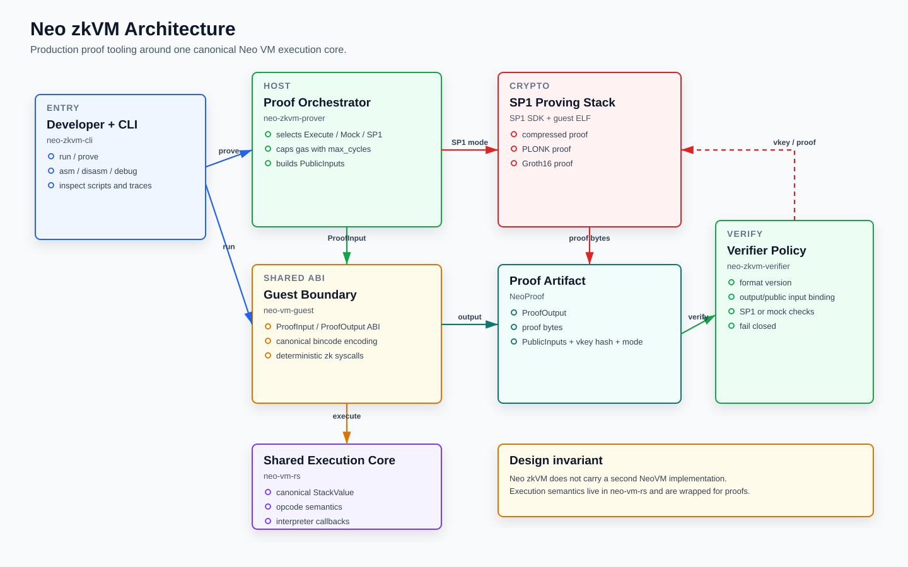

# Neo zkVM

[](https://github.com/r3e-network/neo-zkvm/actions)
[](LICENSE)

A **production-grade** zero-knowledge virtual machine for Neo N3, enabling verifiable computation with cryptographic proofs.

## Features

- **Real ZK Proofs** — SP1 integration for production-grade proving
- **Shared VM semantics** — proof execution uses the canonical `neo-vm-rs` interpreter shared with Neo RISC-V VM
- **Neo N3 compatible** — canonical NeoVM opcodes, stack values, and deterministic zk syscall adapters
- **Runtime gas metering** — each executed instruction costs one gas unit (loops cannot under-charge)
- **Deterministic zk syscalls** — hash/syscall adapters constrained through the shared guest boundary
- **Developer tools** — CLI with assembler, disassembler, execution trace, inspection, proving, and verification

## Architecture



```text
neo-zkvm-cli
  |-- run / prove / asm / disasm / debug
  |
  +--> neo-zkvm-prover -----> SP1 or mock proof generation
  |          |
  |          +--> neo-vm-guest -----> neo-vm-rs canonical interpreter
  |                         |         shared StackValue / ExecutionResult
  |                         +-------> deterministic zk syscall adapters
  |
  +--> neo-zkvm-verifier ---> proof policy and public-input checks

The repository intentionally does not carry a second NeoVM implementation.
Execution semantics live in `neo-vm-rs`; zkVM crates wrap that shared engine for
proof input/output, SP1 proving, verifier policy, and developer tooling.
```

## Quick Start

```bash
# Install from crates.io
CARGO_TARGET_DIR=/tmp/target cargo install neo-zkvm-cli

# Run a script
neo-zkvm run 12139E40  # 2 + 3

# Generate ZK proof (default: SP1)
neo-zkvm prove 12139E40

# Select proof mode explicitly (--proof-mode or -m)
neo-zkvm prove 12139E40 -m mock
neo-zkvm prove 12139E40 -m groth16

# Explicit SP1 mode with fallback allowed
neo-zkvm prove 12139E40 -m sp1 --allow-fallback

# Save a serialized NeoProof and re-verify it (mode is pinned)
neo-zkvm prove 12139E40 -m mock -o proof.bin
neo-zkvm verify proof.bin -m mock

# Valid modes: execute | mock | sp1 | plonk | groth16
```

> For production SP1 proofs from a crates.io install, build from source with `--features sp1`, or reinstall with `NEO_ZKVM_PROGRAM_DIR=/path/to/neo-zkvm-program` so the SP1 guest ELF is compiled at install time.
>
> Explicit `-m sp1/plonk/groth16` fails if it would downgrade to `mock` unless you pass `--allow-fallback`.

## Feature Model

Neo zkVM separates deterministic local development from production SP1 proving:

| Feature set | Purpose | External prerequisites |
| --- | --- | --- |
| default | Neo VM execution, mock proofs, CLI, verifier policy, tests | Rust toolchain only |
| `sp1` | SP1 6.2.1 host prover/verifier integration | `protoc`, Succinct/SP1 toolchain, real guest ELF for production proofs |
| `SP1_FORCE_DUMMY=true` | CI/API compile check for SP1 feature | `protoc`; not valid for production proofs |

Recommended local gates:

```bash
cargo fmt --all -- --check
cargo clippy --workspace --all-targets --locked -- -D warnings
cargo test --workspace --locked
SP1_FORCE_DUMMY=true cargo clippy -p neo-zkvm-prover -p neo-zkvm-verifier -p neo-zkvm-cli --features sp1 --locked -- -D warnings
```

```bash
# Run full production-readiness gates locally
# Requires: cargo install cargo-deny
# Requires protoc and the Succinct/SP1 toolchain for the release proof smoke
./scripts/verify-production.sh

# Core gates (fmt, clippy, tests, deny)
./scripts/test.sh

# Validate release notes/version metadata only
./scripts/verify-release-metadata.sh

# Validate crates.io package assembly only
# Requires neo-vm-rs published on crates.io (workspace builds via git+rev otherwise)
./scripts/verify-packaging.sh

# Print the full release plan without tagging or publishing
./scripts/release.sh --plan

# Print the crates.io publish order without publishing
./scripts/publish-crates.sh --plan
```

## Installation

### From Source

```bash
git clone https://github.com/r3e-network/neo-zkvm
cd neo-zkvm
cargo build --release
# or
./scripts/install.sh
```

### As Library

```toml
[dependencies]
neo-vm-guest = "0.2"
neo-zkvm-prover = "0.2"
neo-zkvm-verifier = "0.2"
```

## Usage

### Execute Script

```rust
use neo_vm_guest::{execute, ProofInput, StackItem};

let output = execute(ProofInput {
    script: vec![0x12, 0x13, 0x9E, 0x40], // 2 + 3
    arguments: vec![],
    gas_limit: 1_000_000,
});

assert_eq!(output.result, Some(StackItem::Integer(5)));
```

### Generate & Verify Proof

```rust
use neo_zkvm_prover::{NeoProver, ProverConfig, ProofMode};
use neo_zkvm_verifier::verify_for_mode;
use neo_vm_guest::ProofInput;

let prover = NeoProver::new(ProverConfig {
    proof_mode: ProofMode::Mock, // Use Mock for testing; Sp1/Plonk/Groth16 for production
    ..Default::default()
});

let input = ProofInput {
    script: vec![0x12, 0x13, 0x9E, 0x40],
    arguments: vec![],
    gas_limit: 1_000_000,
};

let proof = prover.prove(input);
// Always pin the expected mode — never pass proof.proof_mode as the expected value.
assert!(verify_for_mode(&proof, ProofMode::Mock));
```

> **Security note:** Bare `verify(&proof)` dispatches on the attacker-controlled
> `proof.proof_mode` and accepts forgeable Mock/Execute proofs. Production
> consumers that gate value on a proof **must** pin a succinct mode
> (`Sp1` / `Plonk` / `Groth16`) via `verify_for_mode` with a compile-time constant.

## Supported Opcodes

| Category     | Count | Examples                         |
| ------------ | ----- | -------------------------------- |
| Constants    | 25+   | PUSH0-16, PUSHDATA1-4, PUSHINT*  |
| Flow Control | 20+   | JMP, JMPIF, CALL, RET, ASSERT    |
| Stack        | 15+   | DUP, SWAP, ROT, PICK, ROLL       |
| Arithmetic   | 20+   | ADD, SUB, MUL, DIV, MOD, POW     |
| Bitwise      | 10+   | AND, OR, XOR, SHL, SHR           |
| Compound     | 15+   | PACK, NEWARRAY, PICKITEM         |
| Slots        | 20+   | LDLOC, STLOC, LDARG, STARG       |

## Benchmarks

Host-path execution benchmarks (Criterion; not SP1 proving):

```bash
cargo bench -p neo-vm-guest --bench execute
```

```text
execute/arithmetic/add
execute/arithmetic/mul
execute/stack/dup
execute/loop/1000_nops
execute/crypto/sha256
```

## Documentation

- [Getting Started](docs/getting-started.md)
- [Architecture](docs/architecture.md)
- [Visual Figures](docs/figures/README.md)
- [中文图表](docs/zh/figures/README.md)
- [Opcodes Reference](docs/opcodes.md)
- [CLI Reference](docs/cli.md)
- [Formal Verification](docs/formal-verification.md)
- [Completeness Proofs](docs/completeness-proof.md)
- [SP1 v6 Migration Notes](docs/sp1-v6-migration-notes.md)
- [Examples](examples/)

### Use Cases Included in Examples

- **zk_dao_voting**: Anonymous DAO voting logic proving validity without revealing vote choices
- **zk_dex_rollup**: Layer 2 order matching proving batches of transactions under a single root
- **zk_preimage**: Hash preimage proof demonstrating secret password handling
- **zk_scaling**: Off-chain computation scaling via verifiable execution

## License

MIT License — see [LICENSE](LICENSE)
