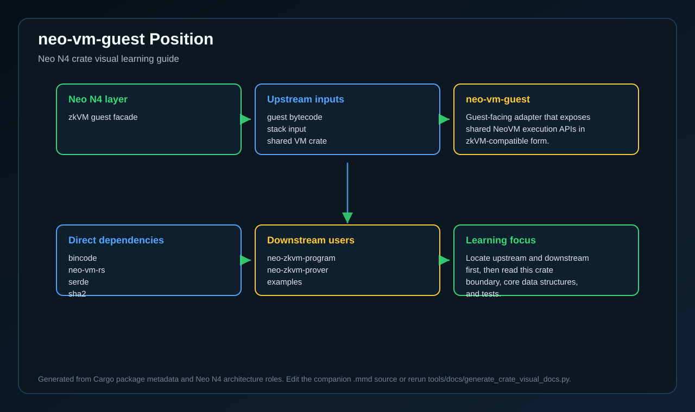
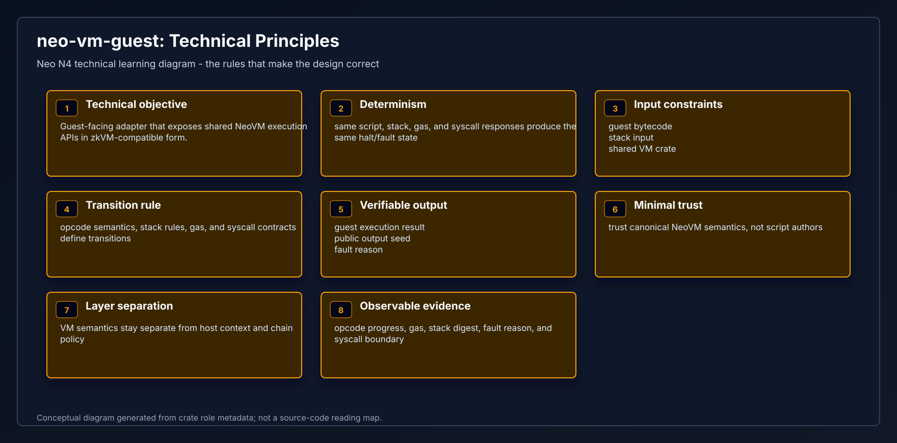
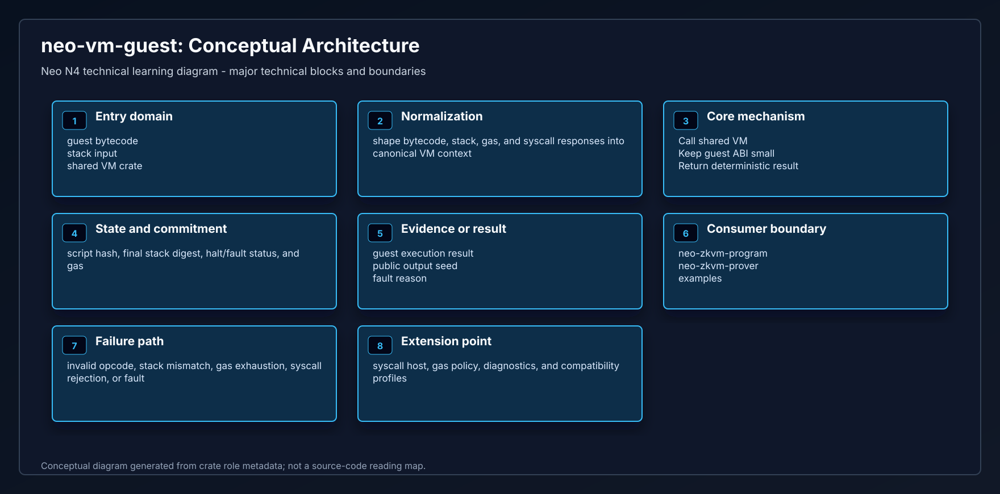
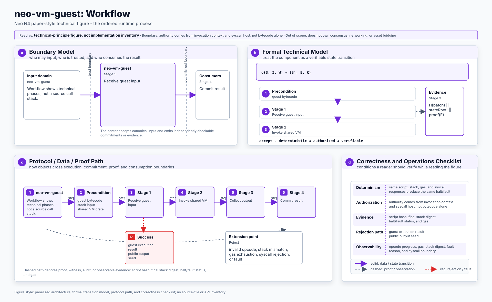
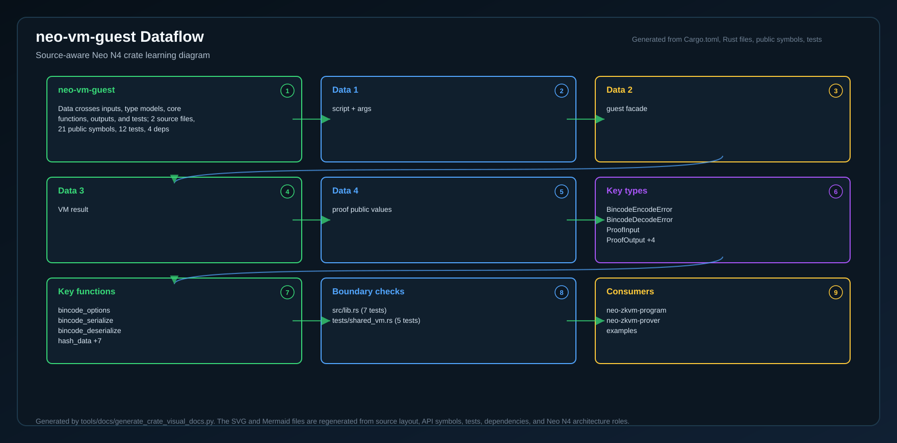
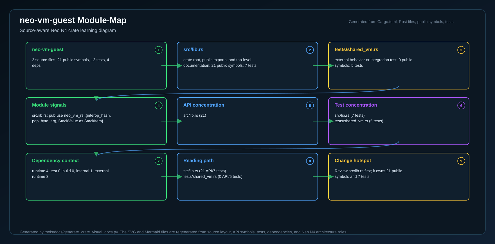
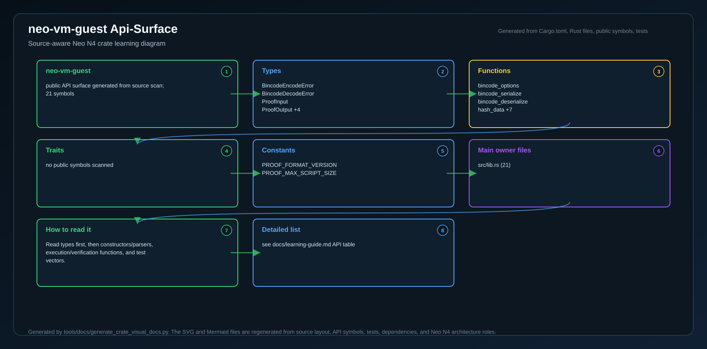
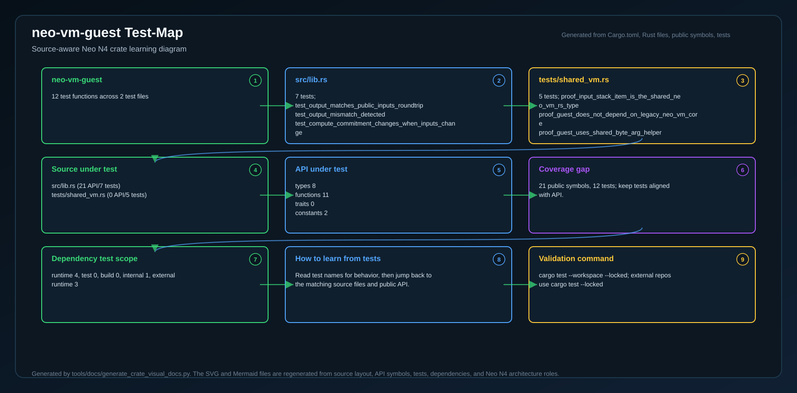
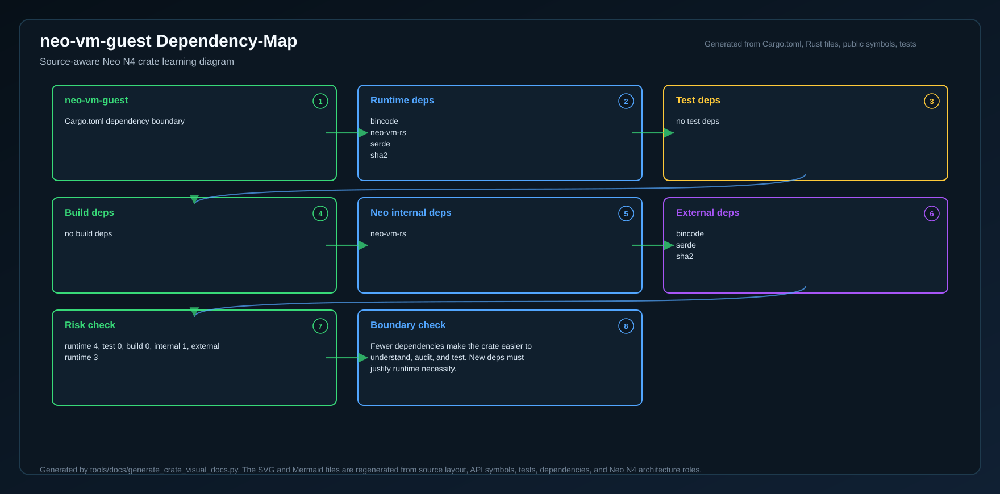
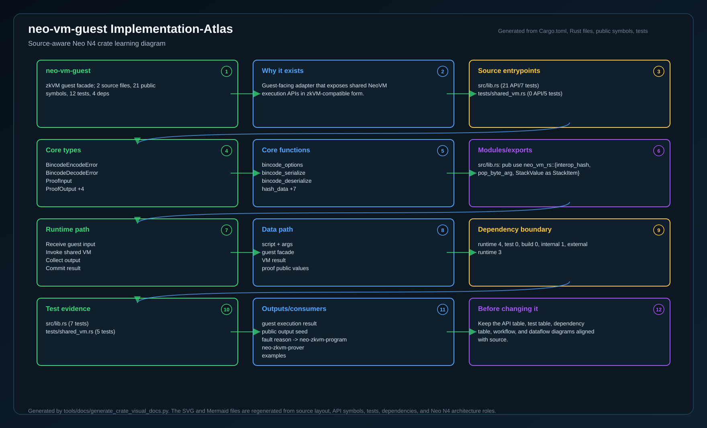

# neo-vm-guest

<!-- N4-CRATE-VISUAL-GUIDE:START -->

## Crate Visual Learning Guide

These diagrams are local to this crate. They explain `neo-vm-guest` as an independent unit: where it sits in the Neo N4 stack, which boundary it owns, how its internal workflow runs, and how data moves through it.

For the full source-level explanation, read [docs/learning-guide.md](docs/learning-guide.md).

| View | Diagram | Source |
| --- | --- | --- |
| Position in Neo N4 |  | [Mermaid](docs/figures/position.mmd) |
| Technical principles |  | [Mermaid](docs/figures/principles.mmd) |
| Architecture |  | [Mermaid](docs/figures/architecture.mmd) |
| Workflow |  | [Mermaid](docs/figures/workflow.mmd) |
| Dataflow |  | [Mermaid](docs/figures/dataflow.mmd) |
| Module map |  | [Mermaid](docs/figures/module-map.mmd) |
| Public API surface |  | [Mermaid](docs/figures/api-surface.mmd) |
| Test evidence |  | [Mermaid](docs/figures/test-map.mmd) |
| Dependency map |  | [Mermaid](docs/figures/dependency-map.mmd) |
| Implementation atlas |  | [Mermaid](docs/figures/implementation-atlas.mmd) |

### Role in Neo N4

- **Layer:** zkVM guest facade
- **Purpose:** Guest-facing adapter that exposes shared NeoVM execution APIs in zkVM-compatible form.
- **Primary inputs:** guest bytecode, stack input, shared VM crate
- **Primary outputs:** guest execution result, public output seed, fault reason
- **Downstream consumers:** neo-zkvm-program, neo-zkvm-prover, examples
- **Source files scanned:** 2
- **Public symbols scanned:** 21
- **Rust tests scanned:** 12

### Boundary and Responsibilities

- **Owns:** Call shared VM, Keep guest ABI small, Return deterministic result
- **Consumes:** guest bytecode, stack input, shared VM crate
- **Produces:** guest execution result, public output seed, fault reason
- **Used by:** neo-zkvm-program, neo-zkvm-prover, examples

### Source Map Snapshot

| File | Why it matters | Public API | Tests |
| --- | --- | ---: | ---: |
| `src/lib.rs` | crate root, public exports, and top-level documentation | 21 | 7 |
| `tests/shared_vm.rs` | external behavior or integration test | 0 | 5 |

### API Snapshot

| Kind | Representative symbols |
| --- | --- |
| Types | BincodeEncodeError   BincodeDecodeError   ProofInput   ProofOutput +4 |
| Functions | bincode_options   bincode_serialize   bincode_deserialize   hash_data +7 |
| Trait | no public symbols scanned |
| Constants | PROOF_FORMAT_VERSION   PROOF_MAX_SCRIPT_SIZE |

### Learning Path

1. Start with the position diagram to understand why this crate exists and who calls it.
2. Read the technical principles diagram to identify the invariants and responsibility boundary.
3. Use the module map and API surface to identify the files and symbols to read first.
4. Follow the workflow, dataflow, test, and dependency diagrams before changing code.
5. Use the implementation atlas as the compact source-reading map when you want one dense view instead of separate technical views.

<!-- N4-CRATE-VISUAL-GUIDE:END -->
