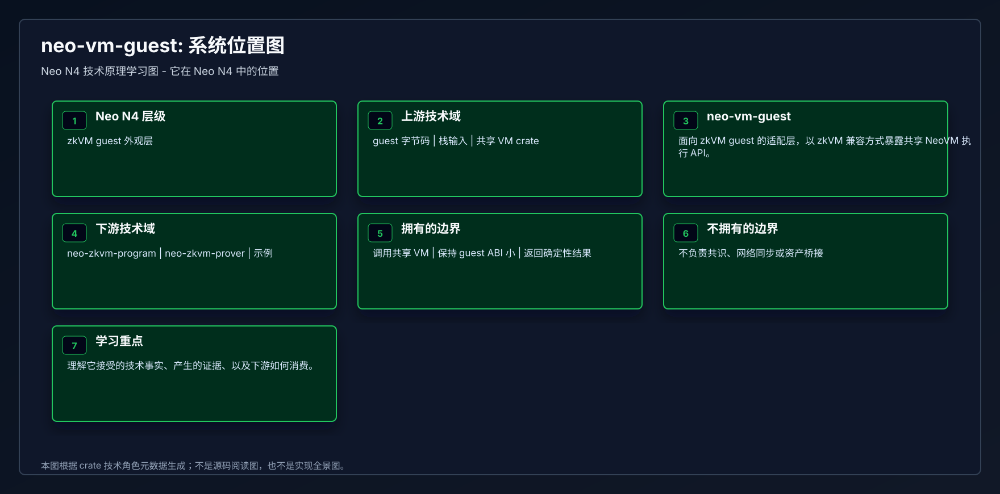
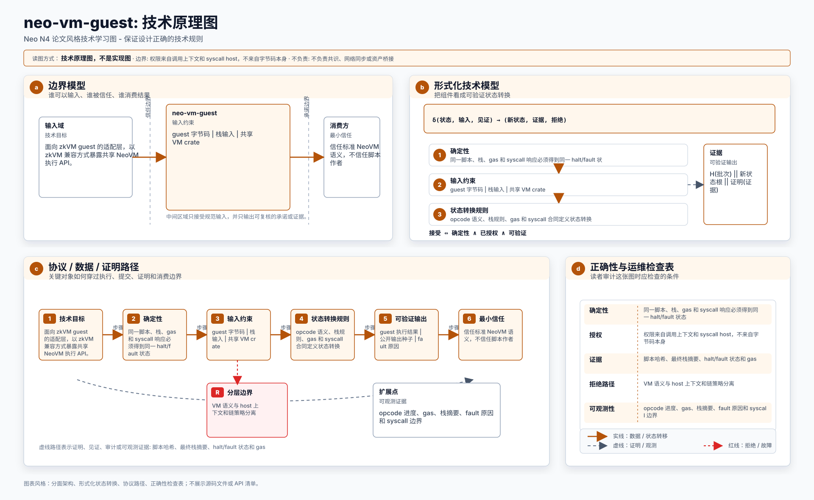
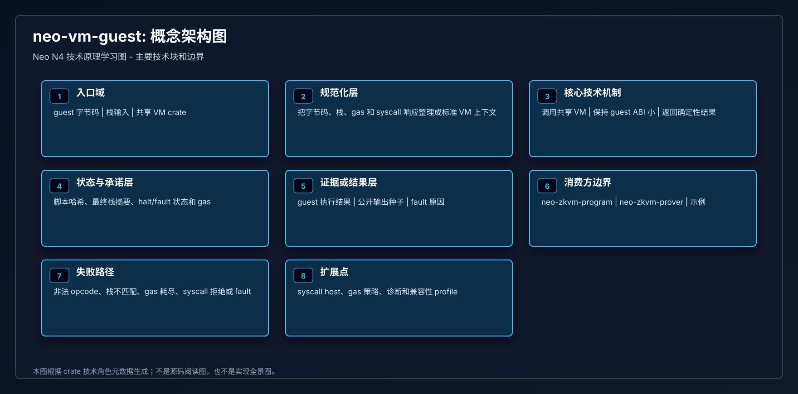
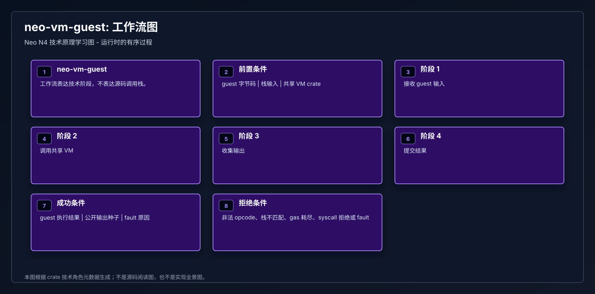
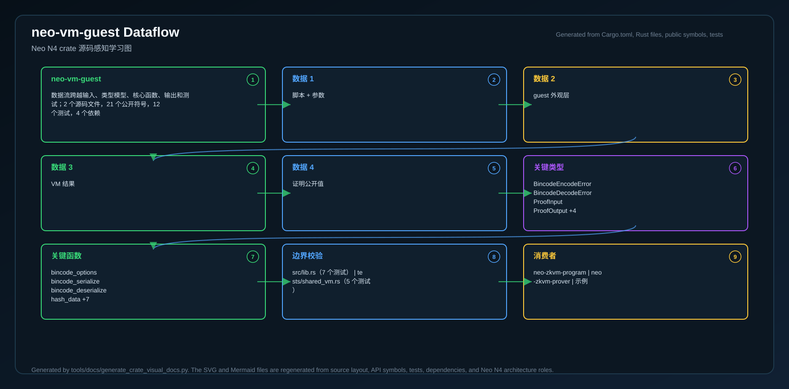

# neo-vm-guest

<!-- N4-CRATE-VISUAL-GUIDE-ZH:START -->

## 可视化学习指南

这些图是 `neo-vm-guest` 自己目录下的 crate 专属学习资料，用来说明它在 Neo N4 中的位置、自己负责的技术边界、内部工作流，以及数据如何流经它。

| 视图 | 图片 | 源文件 |
| --- | --- | --- |
| 在 Neo N4 中的位置 |  | [Mermaid](docs/figures/position.zh.mmd) |
| 技术原理 |  | [Mermaid](docs/figures/principles.zh.mmd) |
| 架构 |  | [Mermaid](docs/figures/architecture.zh.mmd) |
| 工作流 |  | [Mermaid](docs/figures/workflow.zh.mmd) |
| 数据流 |  | [Mermaid](docs/figures/dataflow.zh.mmd) |

### 在 Neo N4 中的作用

- **层级:** zkVM guest 外观层
- **目的:** 面向 zkVM guest 的适配层，以 zkVM 兼容方式暴露共享 NeoVM 执行 API。
- **主要输入:** guest 字节码、栈输入、共享 VM crate
- **主要输出:** guest 执行结果、公开输出种子、fault 原因
- **下游使用者:** neo-zkvm-program、neo-zkvm-prover、示例

### 边界与职责

- **本 crate 负责:** 调用共享 VM、保持 guest ABI 小、返回确定性结果
- **本 crate 消费:** guest 字节码、栈输入、共享 VM crate
- **本 crate 产出:** guest 执行结果、公开输出种子、fault 原因
- **主要被谁使用:** neo-zkvm-program、neo-zkvm-prover、示例

### 学习路径

1. 先看位置图，明确这个 crate 为什么存在、上游是谁、下游是谁。
2. 再看技术原理图，理解它的核心不变量、职责边界和维护规则。
3. 然后看架构图，把公开入口、内部组件、依赖边界和输出产物串起来。
4. 最后看工作流和数据流，再进入源码和测试文件会更容易理解。

<!-- N4-CRATE-VISUAL-GUIDE-ZH:END -->
