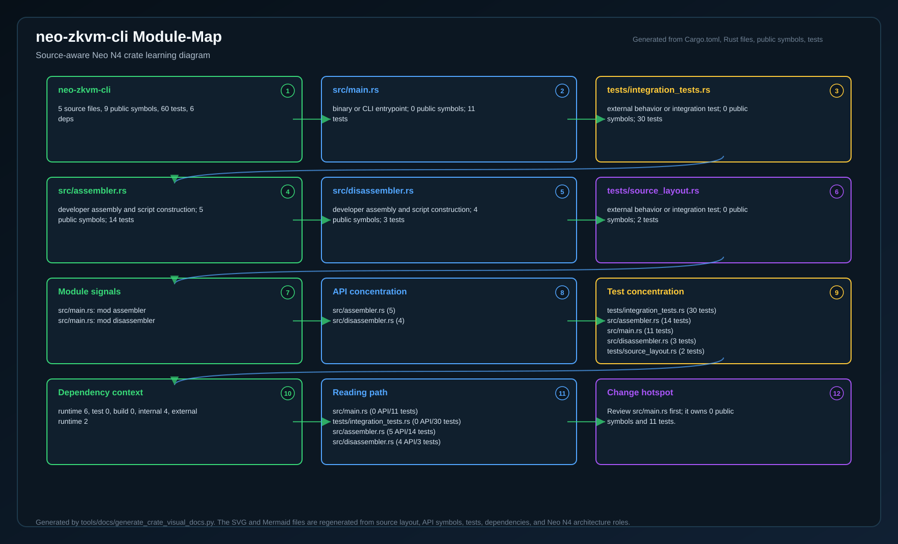
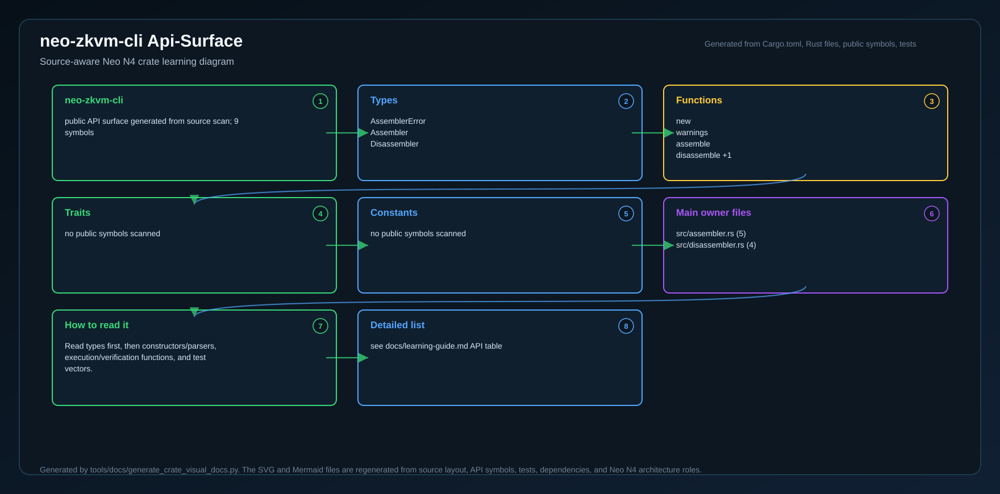
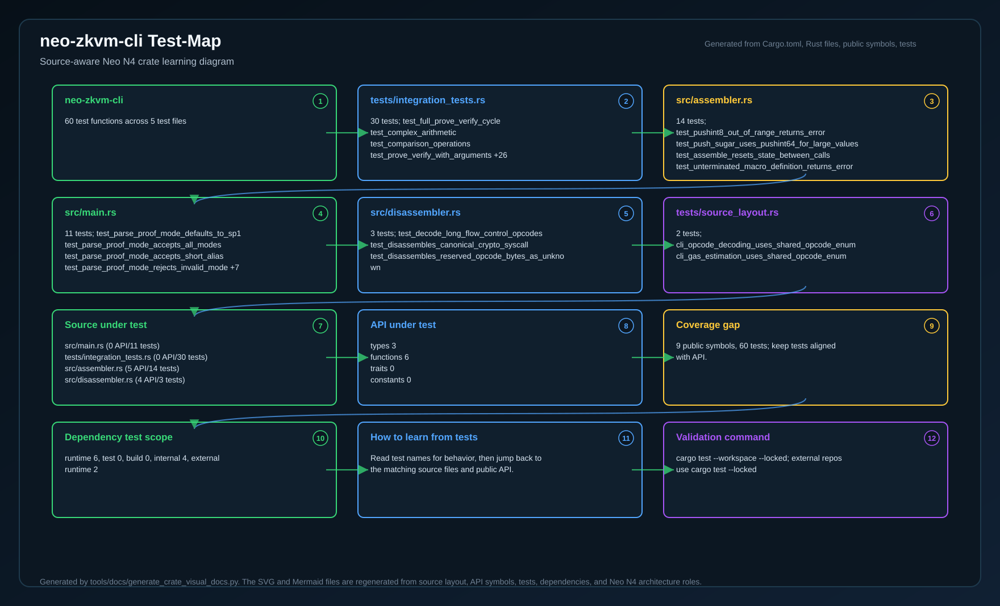
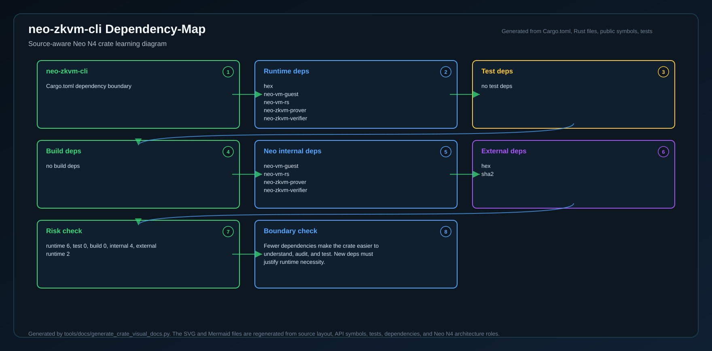

# neo-zkvm-cli

<!-- N4-CRATE-VISUAL-GUIDE:START -->

## Crate Visual Learning Guide

These diagrams are local to this crate. They explain `neo-zkvm-cli` as an independent unit: where it sits in the Neo N4 stack, which boundary it owns, how its internal workflow runs, and how data moves through it.

For the full source-level explanation, read [docs/learning-guide.md](docs/learning-guide.md).

| View | Diagram | Source |
| --- | --- | --- |
| Position in Neo N4 |  | [Mermaid](docs/figures/position.mmd) |
| Technical principles |  | [Mermaid](docs/figures/principles.mmd) |
| Architecture |  | [Mermaid](docs/figures/architecture.mmd) |
| Workflow |  | [Mermaid](docs/figures/workflow.mmd) |
| Dataflow |  | [Mermaid](docs/figures/dataflow.mmd) |
| Module map |  | [Mermaid](docs/figures/module-map.mmd) |
| Public API surface |  | [Mermaid](docs/figures/api-surface.mmd) |
| Test evidence |  | [Mermaid](docs/figures/test-map.mmd) |
| Dependency map |  | [Mermaid](docs/figures/dependency-map.mmd) |

### Role in Neo N4

- **Layer:** Neo zkVM stack
- **Purpose:** CLI and developer tooling for assembling, inspecting, proving, and verifying Neo zkVM programs.
- **Primary inputs:** CLI command, script/proof files, prover options
- **Primary outputs:** assembled script, proof report, inspection output
- **Downstream consumers:** zkVM users, L2 prover service, L1 verification adapter
- **Source files scanned:** 5
- **Public symbols scanned:** 9
- **Rust tests scanned:** 60

### Boundary and Responsibilities

- **Owns:** Parse commands, Use shared opcode metadata, Run prove/verify workflows
- **Consumes:** CLI command, script/proof files, prover options
- **Produces:** assembled script, proof report, inspection output
- **Used by:** zkVM users, L2 prover service, L1 verification adapter

### Source Map Snapshot

| File | Why it matters | Public API | Tests |
| --- | --- | ---: | ---: |
| `src/main.rs` | binary or CLI entrypoint | 0 | 11 |
| `tests/integration_tests.rs` | external behavior or integration test | 0 | 30 |
| `src/assembler.rs` | developer assembly and script construction | 5 | 14 |
| `src/disassembler.rs` | developer assembly and script construction | 4 | 3 |
| `tests/source_layout.rs` | external behavior or integration test | 0 | 2 |

### API Snapshot

| Kind | Representative symbols |
| --- | --- |
| Types | AssemblerError   Assembler   Disassembler |
| Functions | new   warnings   assemble   disassemble +1 |
| Trait | no public symbols scanned |
| Constants | no public symbols scanned |

### Learning Path

1. Start with the position diagram to understand why this crate exists and who calls it.
2. Read the technical principles diagram to identify the invariants and responsibility boundary.
3. Use the module map and API surface to identify the files and symbols to read first.
4. Follow the workflow, dataflow, test, and dependency diagrams before changing code.

<!-- N4-CRATE-VISUAL-GUIDE:END -->
