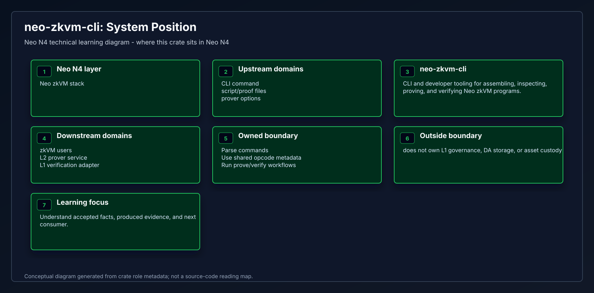
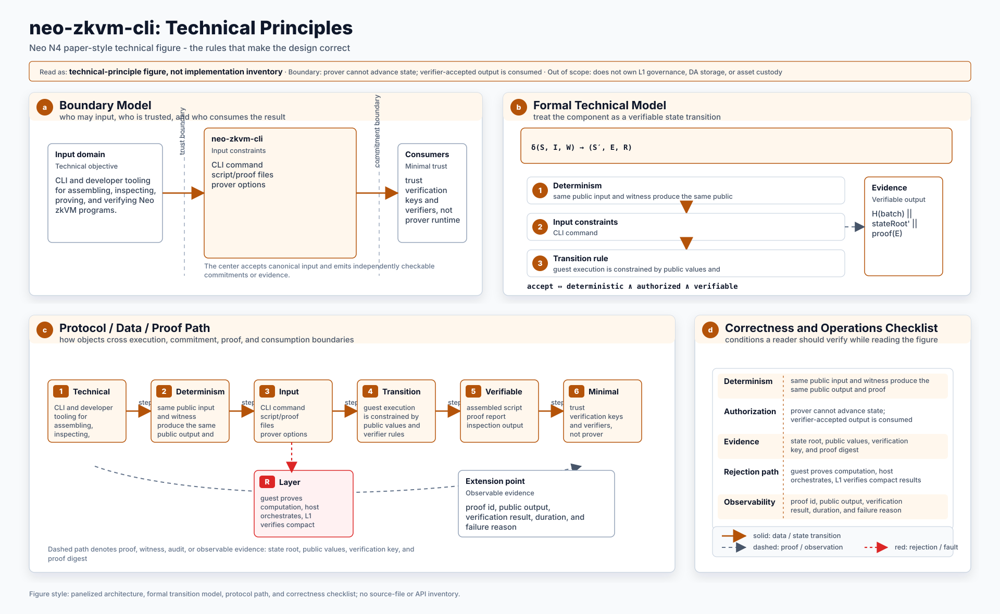
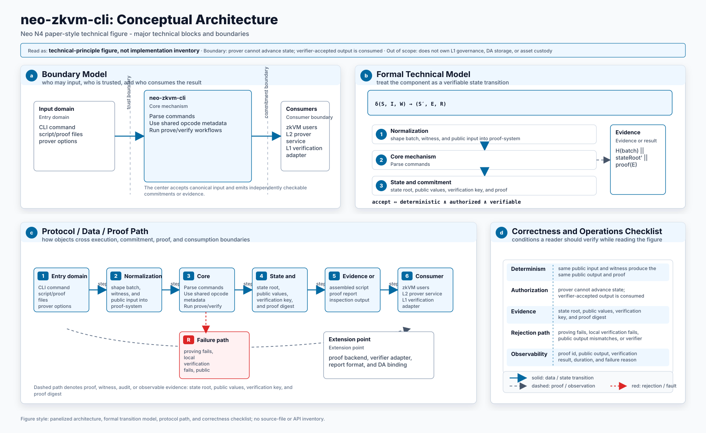
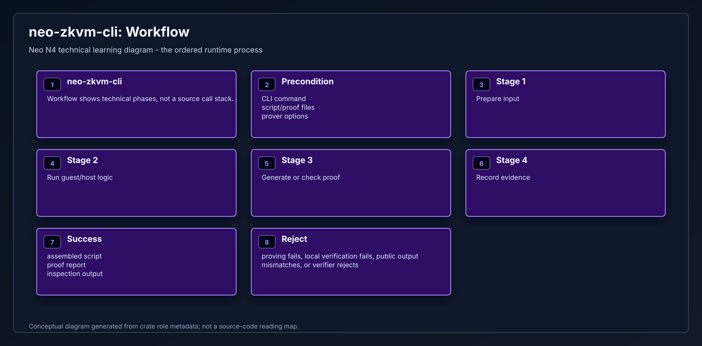
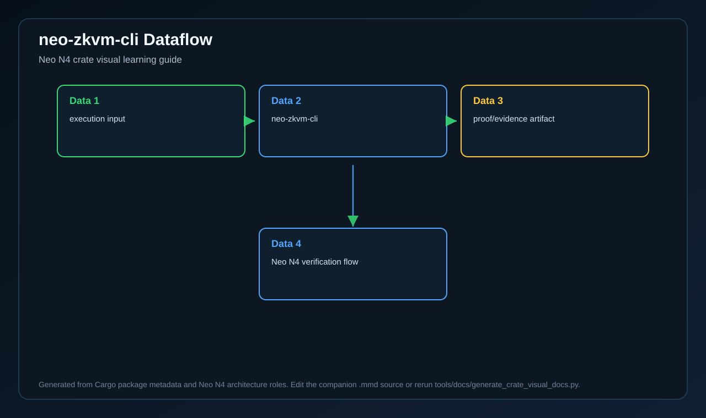

# neo-zkvm-cli

<!-- N4-CRATE-VISUAL-GUIDE:START -->

## Crate Visual Learning Guide

These diagrams are local to this crate. They explain `neo-zkvm-cli` as an independent unit: where it sits in the Neo N4 stack, which boundary it owns, how its internal workflow runs, and how data moves through it.

| View | Diagram | Source |
| --- | --- | --- |
| Position in Neo N4 |  | [Mermaid](docs/figures/position.mmd) |
| Technical principles |  | [Mermaid](docs/figures/principles.mmd) |
| Architecture |  | [Mermaid](docs/figures/architecture.mmd) |
| Workflow |  | [Mermaid](docs/figures/workflow.mmd) |
| Dataflow |  | [Mermaid](docs/figures/dataflow.mmd) |

### Role in Neo N4

- **Layer:** Neo zkVM stack
- **Purpose:** CLI and developer tooling for assembling, inspecting, proving, and verifying Neo zkVM programs.
- **Primary inputs:** CLI command, script/proof files, prover options
- **Primary outputs:** assembled script, proof report, inspection output
- **Downstream consumers:** zkVM users, L2 prover service, L1 verification adapter

### Boundary and Responsibilities

- **Owns:** Parse commands, Use shared opcode metadata, Run prove/verify workflows
- **Consumes:** CLI command, script/proof files, prover options
- **Produces:** assembled script, proof report, inspection output
- **Used by:** zkVM users, L2 prover service, L1 verification adapter

### Learning Path

1. Start with the position diagram to understand why this crate exists and who calls it.
2. Read the technical principles diagram to identify the invariants and responsibility boundary.
3. Use the architecture diagram to connect public inputs, internal components, dependencies, and outputs.
4. Follow the workflow and dataflow diagrams before reading source files or tests.

<!-- N4-CRATE-VISUAL-GUIDE:END -->
