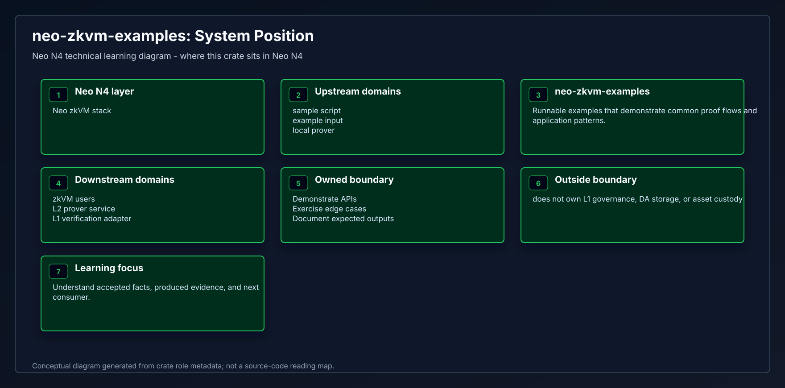
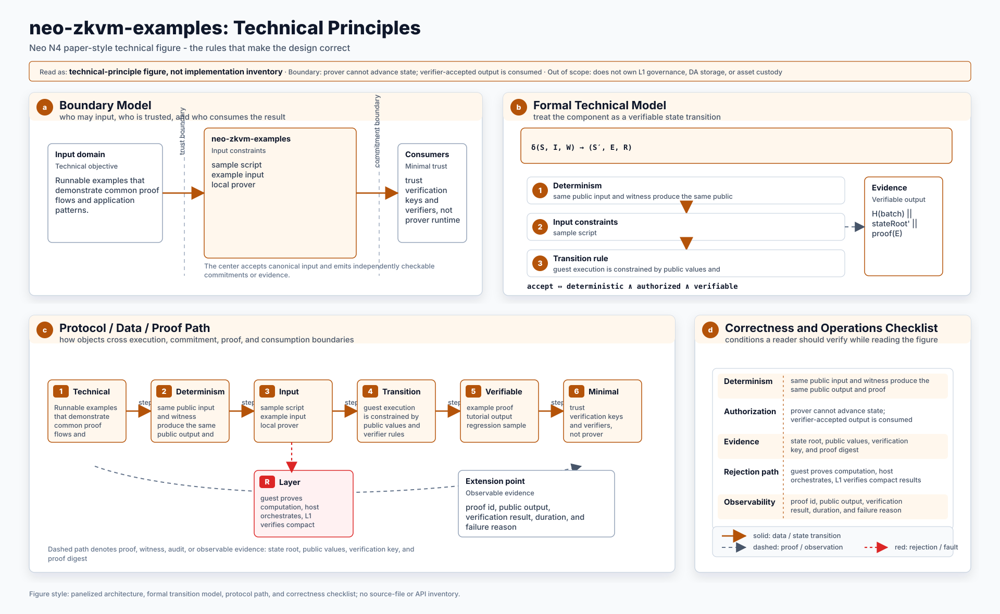
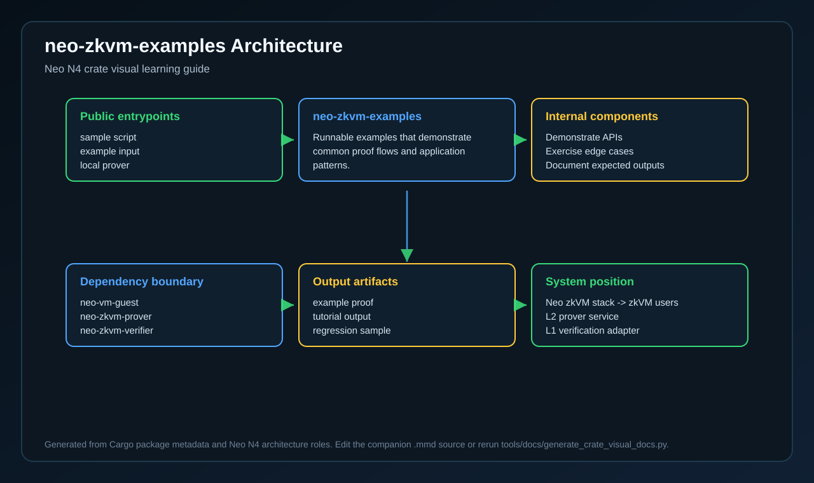
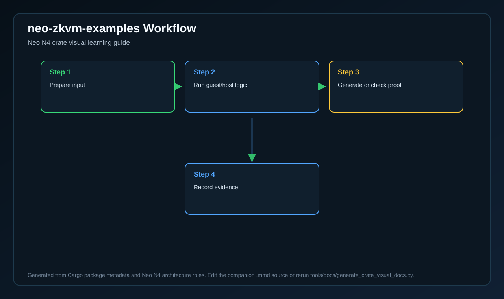
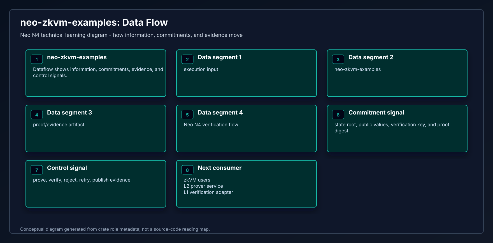
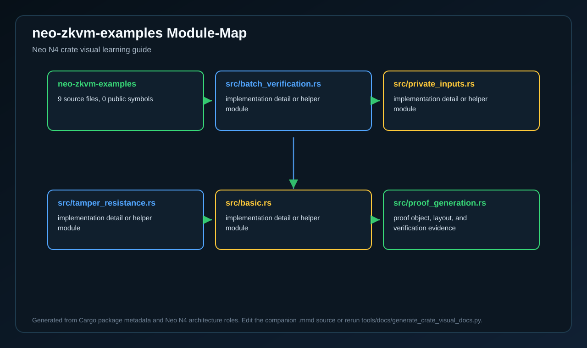
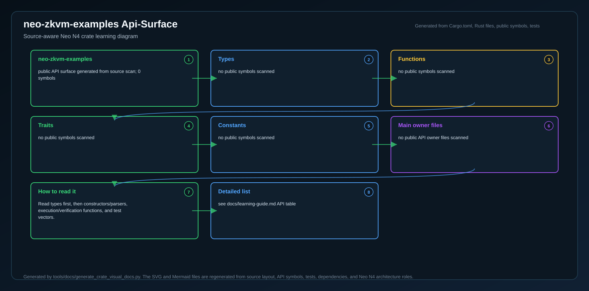
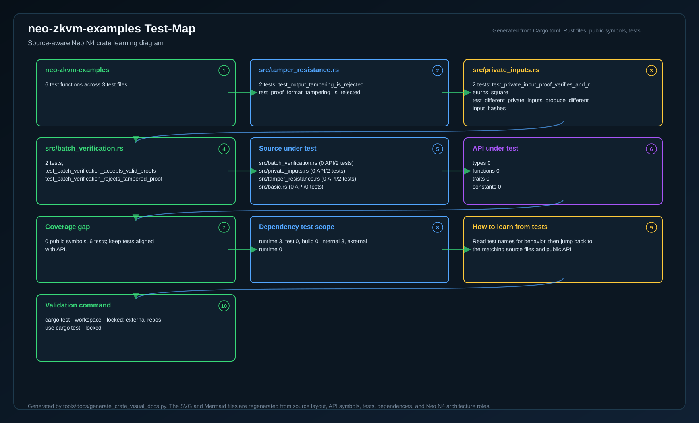
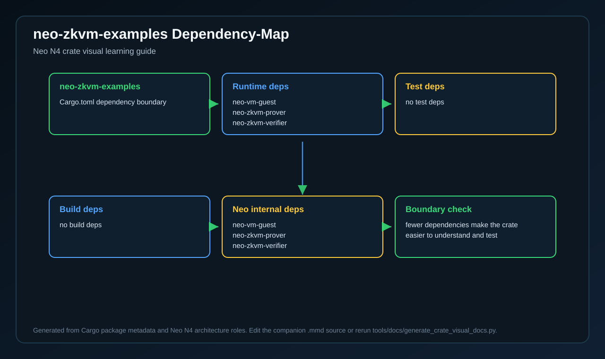
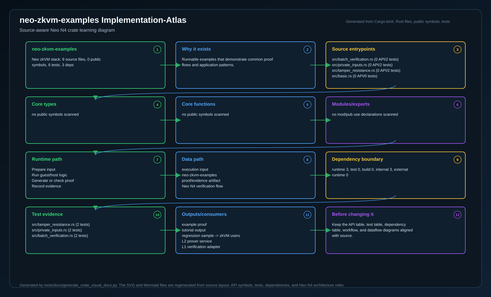

# neo-zkvm-examples

<!-- N4-CRATE-VISUAL-GUIDE:START -->

## Crate Visual Learning Guide

These diagrams are local to this crate. They explain `neo-zkvm-examples` as an independent unit: where it sits in the Neo N4 stack, which boundary it owns, how its internal workflow runs, and how data moves through it.

For the full source-level explanation, read [docs/learning-guide.md](docs/learning-guide.md).

| View | Diagram | Source |
| --- | --- | --- |
| Position in Neo N4 |  | [Mermaid](docs/figures/position.mmd) |
| Technical principles |  | [Mermaid](docs/figures/principles.mmd) |
| Architecture |  | [Mermaid](docs/figures/architecture.mmd) |
| Workflow |  | [Mermaid](docs/figures/workflow.mmd) |
| Dataflow |  | [Mermaid](docs/figures/dataflow.mmd) |
| Module map |  | [Mermaid](docs/figures/module-map.mmd) |
| Public API surface |  | [Mermaid](docs/figures/api-surface.mmd) |
| Test evidence |  | [Mermaid](docs/figures/test-map.mmd) |
| Dependency map |  | [Mermaid](docs/figures/dependency-map.mmd) |
| Implementation atlas |  | [Mermaid](docs/figures/implementation-atlas.mmd) |

### Role in Neo N4

- **Layer:** Neo zkVM stack
- **Purpose:** Runnable examples that demonstrate common proof flows and application patterns.
- **Primary inputs:** sample script, example input, local prover
- **Primary outputs:** example proof, tutorial output, regression sample
- **Downstream consumers:** zkVM users, L2 prover service, L1 verification adapter
- **Source files scanned:** 9
- **Public symbols scanned:** 0
- **Rust tests scanned:** 6

### Boundary and Responsibilities

- **Owns:** Demonstrate APIs, Exercise edge cases, Document expected outputs
- **Consumes:** sample script, example input, local prover
- **Produces:** example proof, tutorial output, regression sample
- **Used by:** zkVM users, L2 prover service, L1 verification adapter

### Source Map Snapshot

| File | Why it matters | Public API | Tests |
| --- | --- | ---: | ---: |
| `src/batch_verification.rs` | implementation detail or helper module | 0 | 2 |
| `src/private_inputs.rs` | implementation detail or helper module | 0 | 2 |
| `src/tamper_resistance.rs` | implementation detail or helper module | 0 | 2 |
| `src/basic.rs` | implementation detail or helper module | 0 | 0 |
| `src/proof_generation.rs` | proof object, layout, and verification evidence | 0 | 0 |
| `src/zk_dao_voting.rs` | implementation detail or helper module | 0 | 0 |
| `src/zk_dex_rollup.rs` | implementation detail or helper module | 0 | 0 |
| `src/zk_preimage.rs` | implementation detail or helper module | 0 | 0 |

### API Snapshot

| Kind | Representative symbols |
| --- | --- |
| Types | no public symbols scanned |
| Functions | no public symbols scanned |
| Trait | no public symbols scanned |
| Constants | no public symbols scanned |

### Learning Path

1. Start with the position diagram to understand why this crate exists and who calls it.
2. Read the technical principles diagram to identify the invariants and responsibility boundary.
3. Use the module map and API surface to identify the files and symbols to read first.
4. Follow the workflow, dataflow, test, and dependency diagrams before changing code.
5. Use the implementation atlas as the compact source-reading map when you want one dense view instead of separate technical views.

<!-- N4-CRATE-VISUAL-GUIDE:END -->
