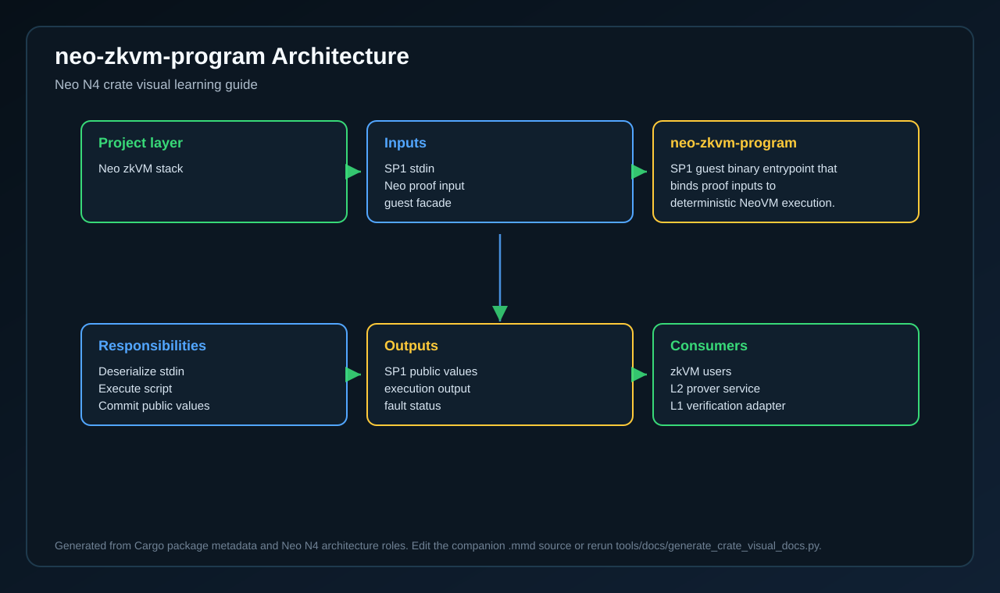
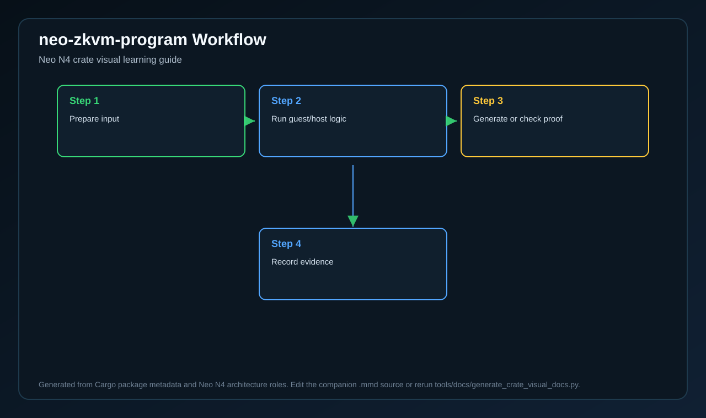
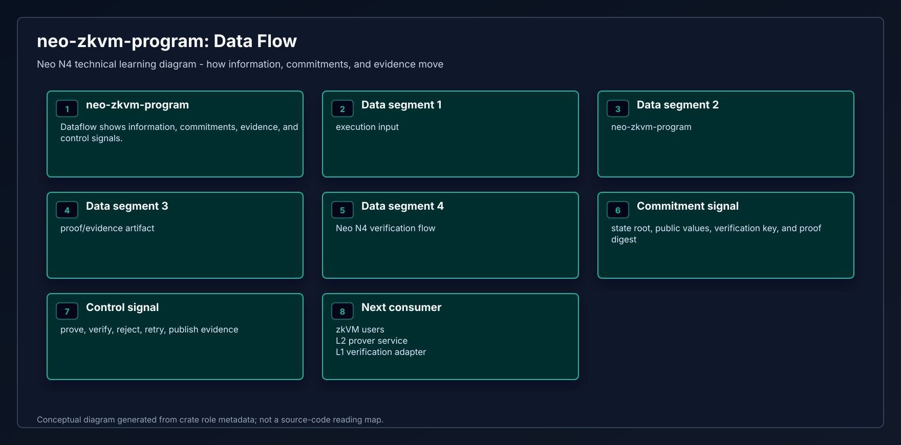

# neo-zkvm-program

<!-- N4-CRATE-VISUAL-GUIDE:START -->

## Visual Architecture Guide

These diagrams explain where `neo-zkvm-program` sits in the Neo N4 stack, how its main workflow runs, and how data moves through it.

| View | Diagram | Source |
| --- | --- | --- |
| Architecture |  | [Mermaid](docs/figures/architecture.mmd) |
| Workflow |  | [Mermaid](docs/figures/workflow.mmd) |
| Dataflow |  | [Mermaid](docs/figures/dataflow.mmd) |

### Role in Neo N4

- **Layer:** Neo zkVM stack
- **Purpose:** SP1 guest binary entrypoint that binds proof inputs to deterministic NeoVM execution.
- **Primary inputs:** SP1 stdin, Neo proof input, guest facade
- **Primary outputs:** SP1 public values, execution output, fault status
- **Downstream consumers:** zkVM users, L2 prover service, L1 verification adapter

### Learning Path

1. Start with the architecture diagram to understand the crate boundary.
2. Follow the workflow diagram to see the normal execution path.
3. Use the dataflow diagram to connect inputs, state changes, and outputs.
4. Read the crate source after the diagrams so module-level details have context.

<!-- N4-CRATE-VISUAL-GUIDE:END -->
