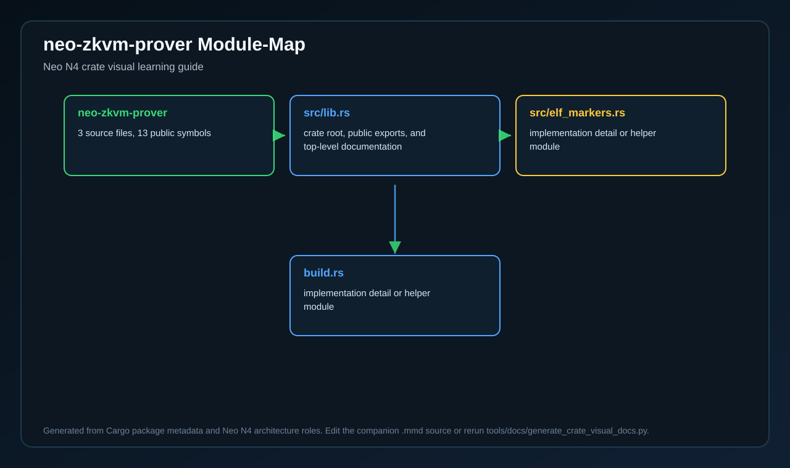
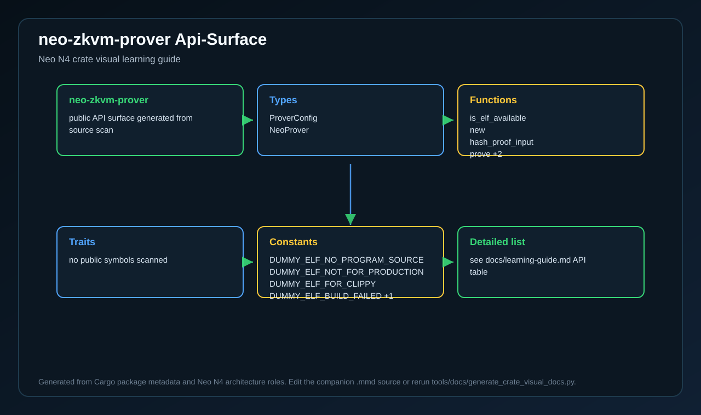
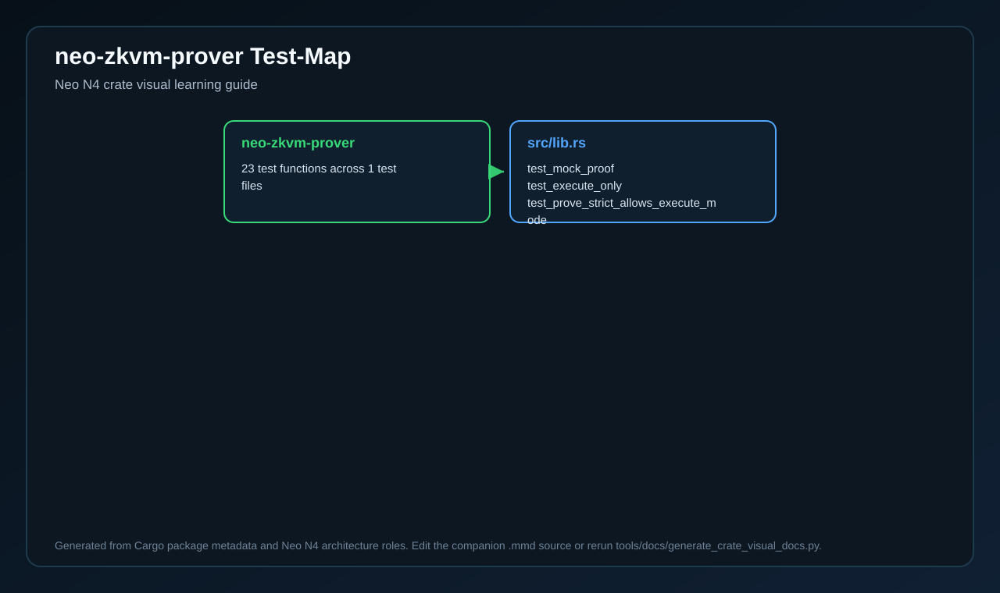
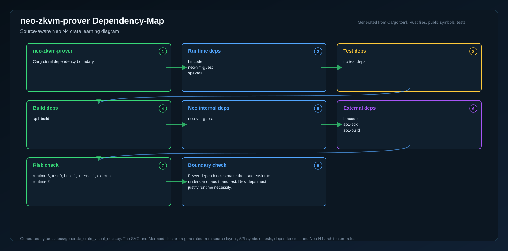

# neo-zkvm-prover

<!-- N4-CRATE-VISUAL-GUIDE:START -->

## Crate Visual Learning Guide

These diagrams are local to this crate. They explain `neo-zkvm-prover` as an independent unit: where it sits in the Neo N4 stack, which boundary it owns, how its internal workflow runs, and how data moves through it.

For the full source-level explanation, read [docs/learning-guide.md](docs/learning-guide.md).

| View | Diagram | Source |
| --- | --- | --- |
| Position in Neo N4 |  | [Mermaid](docs/figures/position.mmd) |
| Technical principles |  | [Mermaid](docs/figures/principles.mmd) |
| Architecture |  | [Mermaid](docs/figures/architecture.mmd) |
| Workflow |  | [Mermaid](docs/figures/workflow.mmd) |
| Dataflow |  | [Mermaid](docs/figures/dataflow.mmd) |
| Module map |  | [Mermaid](docs/figures/module-map.mmd) |
| Public API surface |  | [Mermaid](docs/figures/api-surface.mmd) |
| Test evidence |  | [Mermaid](docs/figures/test-map.mmd) |
| Dependency map |  | [Mermaid](docs/figures/dependency-map.mmd) |

### Role in Neo N4

- **Layer:** Neo zkVM stack
- **Purpose:** Proof generation library that turns NeoVM execution inputs into verifiable proof artifacts.
- **Primary inputs:** proof input, guest program, prover mode
- **Primary outputs:** NeoProof, public output, prover report
- **Downstream consumers:** zkVM users, L2 prover service, L1 verification adapter
- **Source files scanned:** 3
- **Public symbols scanned:** 13
- **Rust tests scanned:** 23

### Boundary and Responsibilities

- **Owns:** Hash inputs, Run guest execution, Build proof envelope
- **Consumes:** proof input, guest program, prover mode
- **Produces:** NeoProof, public output, prover report
- **Used by:** zkVM users, L2 prover service, L1 verification adapter

### Source Map Snapshot

| File | Why it matters | Public API | Tests |
| --- | --- | ---: | ---: |
| `src/lib.rs` | crate root, public exports, and top-level documentation | 9 | 23 |
| `src/elf_markers.rs` | implementation detail or helper module | 4 | 0 |
| `build.rs` | implementation detail or helper module | 0 | 0 |

### API Snapshot

| Kind | Representative symbols |
| --- | --- |
| Types | ProverConfig   NeoProver |
| Functions | is_elf_available   new   hash_proof_input   prove +2 |
| Trait | no public symbols scanned |
| Constants | DUMMY_ELF_NO_PROGRAM_SOURCE   DUMMY_ELF_NOT_FOR_PRODUCTION   DUMMY_ELF_FOR_CLIPPY   DUMMY_ELF_BUILD_FAILED +1 |

### Learning Path

1. Start with the position diagram to understand why this crate exists and who calls it.
2. Read the technical principles diagram to identify the invariants and responsibility boundary.
3. Use the module map and API surface to identify the files and symbols to read first.
4. Follow the workflow, dataflow, test, and dependency diagrams before changing code.

<!-- N4-CRATE-VISUAL-GUIDE:END -->
