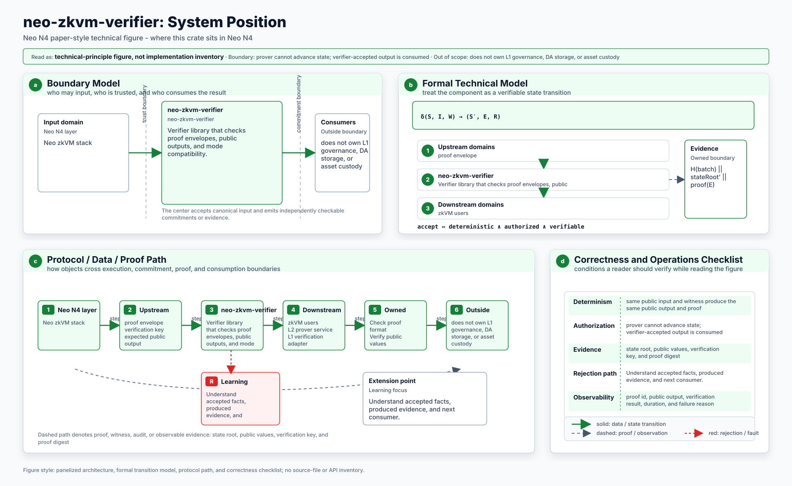
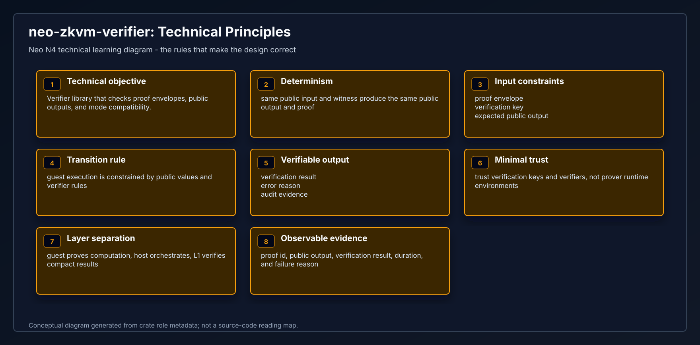
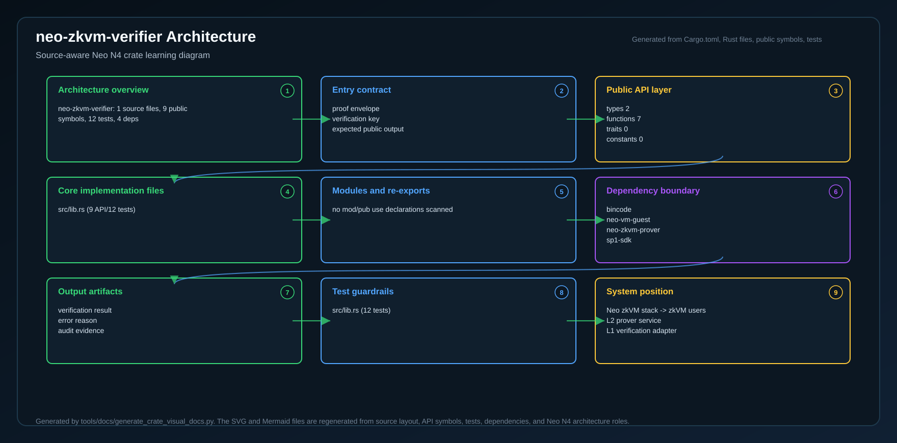
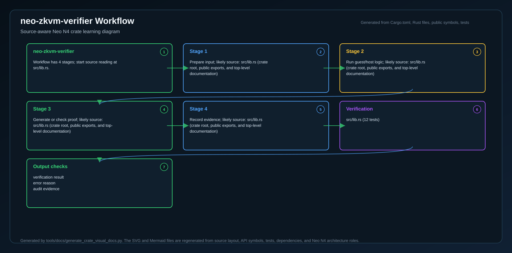
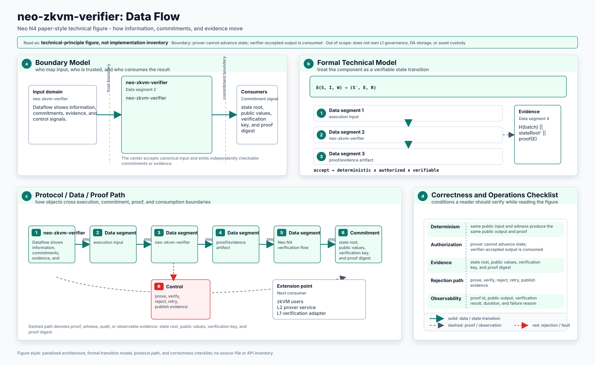
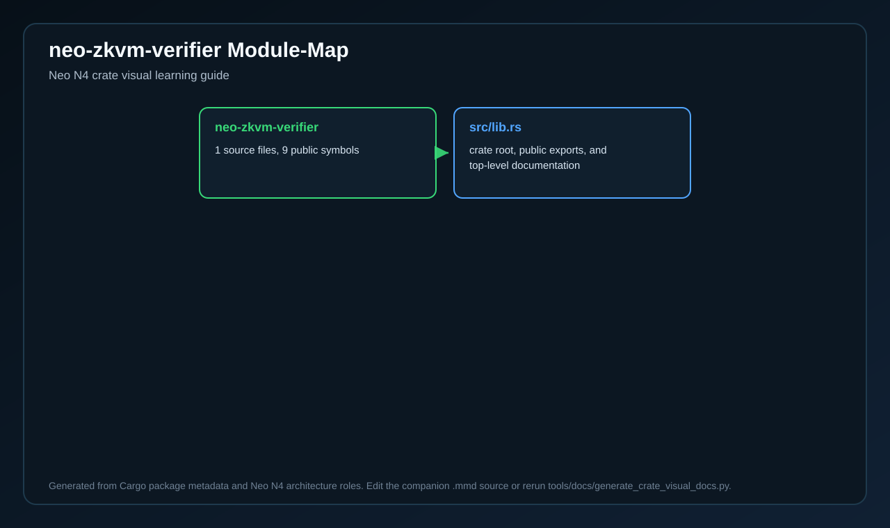
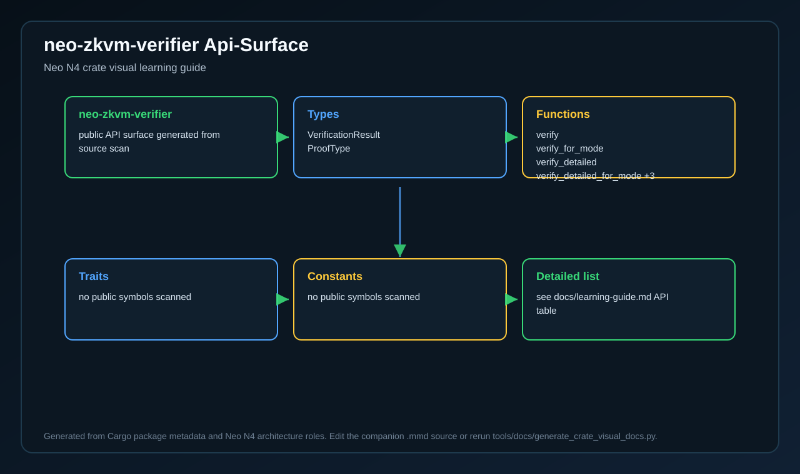
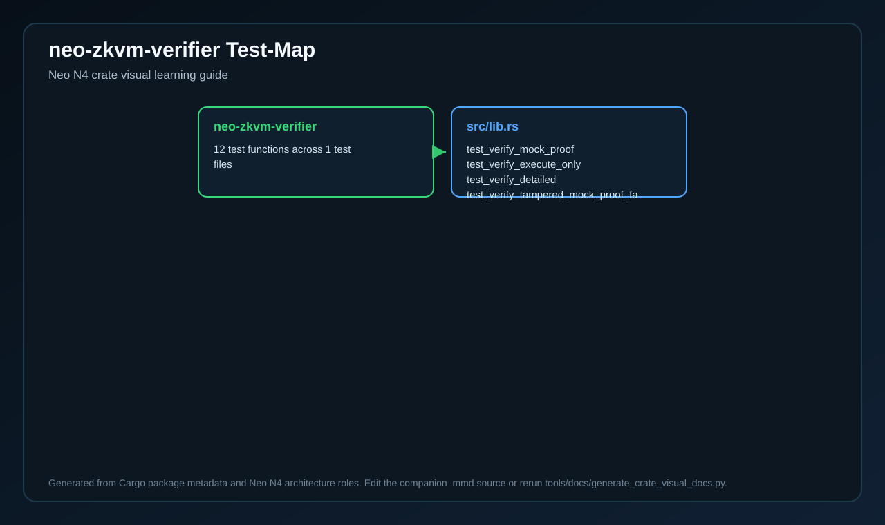
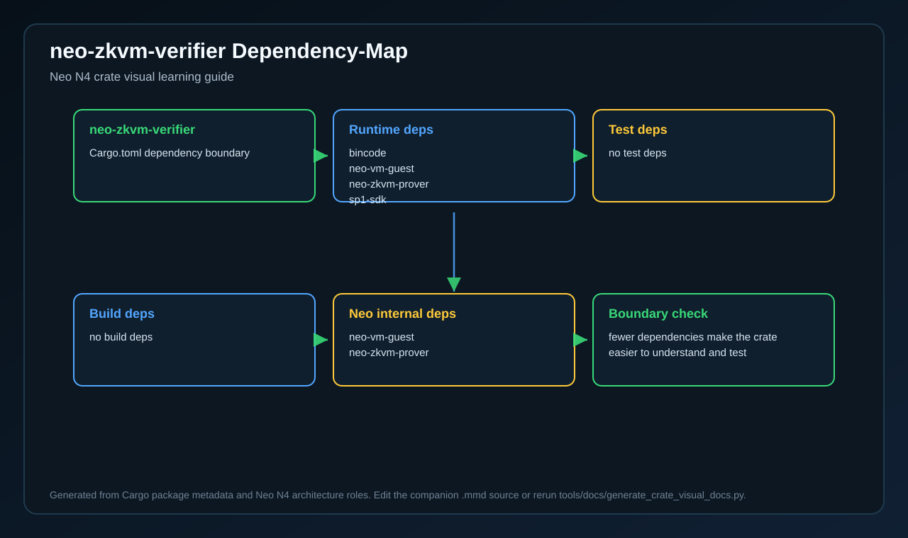

# neo-zkvm-verifier

<!-- N4-CRATE-VISUAL-GUIDE:START -->

## Crate Visual Learning Guide

These diagrams are local to this crate. They explain `neo-zkvm-verifier` as an independent unit: where it sits in the Neo N4 stack, which boundary it owns, how its internal workflow runs, and how data moves through it.

For the full source-level explanation, read [docs/learning-guide.md](docs/learning-guide.md).

| View | Diagram | Source |
| --- | --- | --- |
| Position in Neo N4 |  | [Mermaid](docs/figures/position.mmd) |
| Technical principles |  | [Mermaid](docs/figures/principles.mmd) |
| Architecture |  | [Mermaid](docs/figures/architecture.mmd) |
| Workflow |  | [Mermaid](docs/figures/workflow.mmd) |
| Dataflow |  | [Mermaid](docs/figures/dataflow.mmd) |
| Module map |  | [Mermaid](docs/figures/module-map.mmd) |
| Public API surface |  | [Mermaid](docs/figures/api-surface.mmd) |
| Test evidence |  | [Mermaid](docs/figures/test-map.mmd) |
| Dependency map |  | [Mermaid](docs/figures/dependency-map.mmd) |

### Role in Neo N4

- **Layer:** Neo zkVM stack
- **Purpose:** Verifier library that checks proof envelopes, public outputs, and mode compatibility.
- **Primary inputs:** proof envelope, verification key, expected public output
- **Primary outputs:** verification result, error reason, audit evidence
- **Downstream consumers:** zkVM users, L2 prover service, L1 verification adapter
- **Source files scanned:** 1
- **Public symbols scanned:** 9
- **Rust tests scanned:** 12

### Boundary and Responsibilities

- **Owns:** Check proof format, Verify public values, Report validity
- **Consumes:** proof envelope, verification key, expected public output
- **Produces:** verification result, error reason, audit evidence
- **Used by:** zkVM users, L2 prover service, L1 verification adapter

### Source Map Snapshot

| File | Why it matters | Public API | Tests |
| --- | --- | ---: | ---: |
| `src/lib.rs` | crate root, public exports, and top-level documentation | 9 | 12 |

### API Snapshot

| Kind | Representative symbols |
| --- | --- |
| Types | VerificationResult   ProofType |
| Functions | verify   verify_for_mode   verify_detailed   verify_detailed_for_mode +3 |
| Trait | no public symbols scanned |
| Constants | no public symbols scanned |

### Learning Path

1. Start with the position diagram to understand why this crate exists and who calls it.
2. Read the technical principles diagram to identify the invariants and responsibility boundary.
3. Use the module map and API surface to identify the files and symbols to read first.
4. Follow the workflow, dataflow, test, and dependency diagrams before changing code.

<!-- N4-CRATE-VISUAL-GUIDE:END -->
