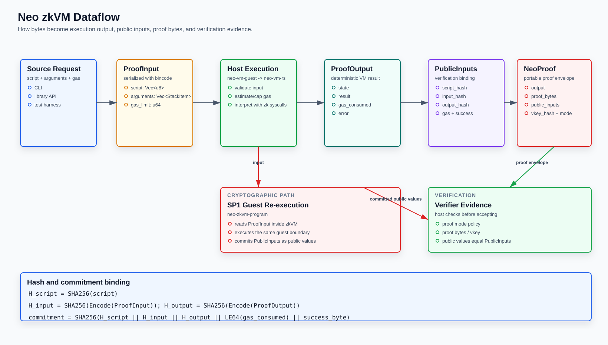

# Neo zkVM Architecture

Neo zkVM provides zero-knowledge proof tooling for Neo VM execution. The project keeps one source of execution semantics: `neo-vm-rs`. The zkVM crates wrap that shared interpreter for proof input/output, SP1 proving, verifier policy, and developer tooling.

## System Flow



```text
script + arguments + gas limit
        |
        v
neo-vm-guest
  - validates ProofInput
  - executes via neo-vm-rs
  - emits ProofOutput and public input hashes
        |
        v
neo-zkvm-prover
  - Execute: deterministic local execution only
  - Mock: fast proof envelope for tests
  - Sp1/Plonk/Groth16: SP1-backed proof modes
        |
        v
neo-zkvm-verifier
  - checks proof mode policy
  - checks vkey/public input binding
  - verifies proof bytes when a real proof mode is used
```

## Workspace Components

| Component | Responsibility |
| --- | --- |
| `neo-vm-guest` | Proof input/output ABI, canonical bincode helpers, zk guest execution wrapper around `neo-vm-rs`. |
| `neo-zkvm-prover` | Proof orchestration and mode selection for execute, mock, SP1, PLONK, and Groth16. |
| `neo-zkvm-verifier` | Verification policy and proof/public-input validation. |
| `neo-zkvm-cli` | Developer CLI for run, prove, verify, asm, disasm, trace, and inspect. |
| `neo-zkvm-examples` | Runnable examples that demonstrate shared-VM proof flows. |

## Shared VM Boundary

`neo-vm-rs` owns opcode behavior, stack value definitions, VM state, syscall metadata, and interpreter callbacks. Neo zkVM must not fork or reimplement those semantics. New opcodes, StackValue changes, or syscall ABI changes should land in `neo-vm-rs` first, then be consumed here through the guest crate.

## Proof Input and Output

```rust
pub struct ProofInput {
    pub script: Vec<u8>,
    pub arguments: Vec<StackItem>,
    pub gas_limit: u64,
}

pub struct ProofOutput {
    pub state: u8,
    pub result: Option<StackItem>,
    pub gas_consumed: u64,
    pub error: Option<String>,
}
```

`StackItem` is re-exported from `neo-vm-rs` as the canonical StackValue type. Public input hashes bind the serialized input, serialized output, script hash, gas usage, and success flag.

## Syscall Model

The guest exposes deterministic syscall adapters that are safe inside proof execution. Host-only or chain-state-dependent behavior must be represented as explicit inputs or commitments. The trace CLI supports deterministic syscall tracing for supported adapters such as `System.Crypto.SHA256`.

## Design Rules

1. Do not add another VM engine to this repository.
2. Put reusable execution semantics in `neo-vm-rs`.
3. Keep prover and verifier crates independent from CLI concerns.
4. Keep examples aligned with real Cargo binaries.
5. Treat SP1 fallback as explicit: production proof modes must not silently degrade unless `--allow-fallback` is supplied.
