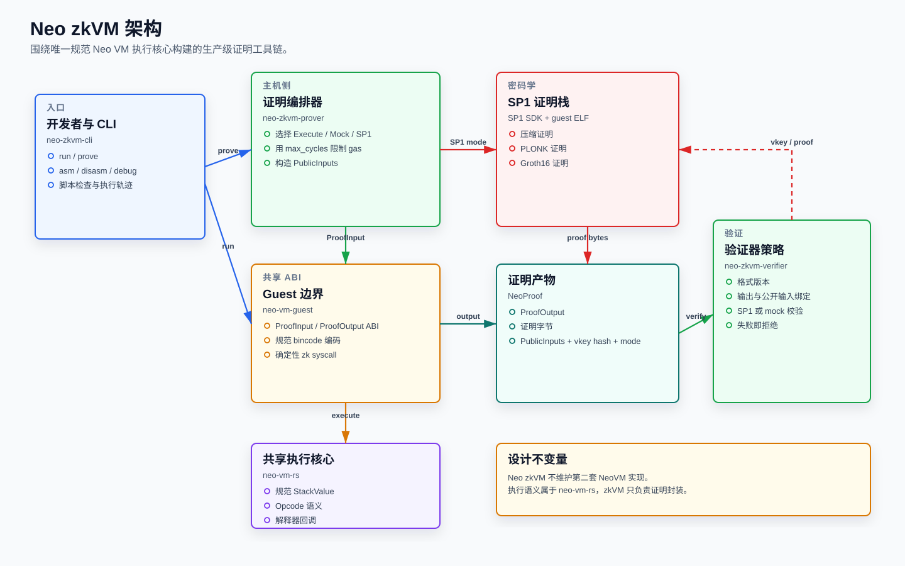

# Neo zkVM 图表

这些图表是 Neo zkVM 实现的可视化说明。它们由 `docs/figures/generate_figures.py` 生成，因此英文版和中文版保持结构一致。

## 图表集合

| 图表 | 用途 |
| --- | --- |
| [架构](neo-zkvm-architecture.zh.svg) | 展示 crate 边界、SP1 集成、验证器策略，以及共享的 `neo-vm-rs` 执行核心。 |
| [数据流](neo-zkvm-dataflow.zh.svg) | 展示脚本如何变成 `ProofInput`、`ProofOutput`、`PublicInputs`、证明字节和验证证据。 |
| [工作流](neo-zkvm-workflow.zh.svg) | 展示 `run`、`prove` 和验证路径在 CLI 与库中的操作流程。 |
| [证明对象](neo-zkvm-proof-objects.zh.svg) | 展示证明 ABI 结构，以及它们如何绑定到 `neo-vm-rs` 类型。 |
| [验证逻辑](neo-zkvm-verification.zh.svg) | 展示 Execute、Mock、SP1、PLONK、Groth16 模式下失败即拒绝的验证检查。 |
| [数学设计](neo-zkvm-math.zh.svg) | 展示哈希、承诺、公开输入和验证器接受条件。 |

## 预览

## 其他语言

- [English figures](../../figures/README.md)
