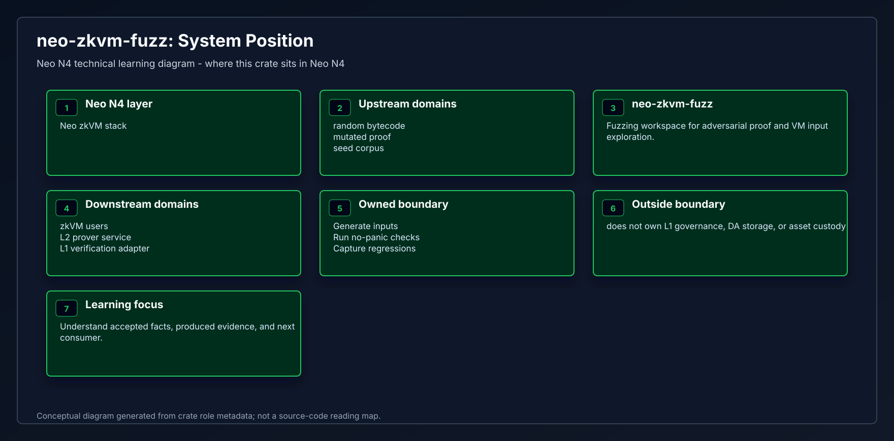
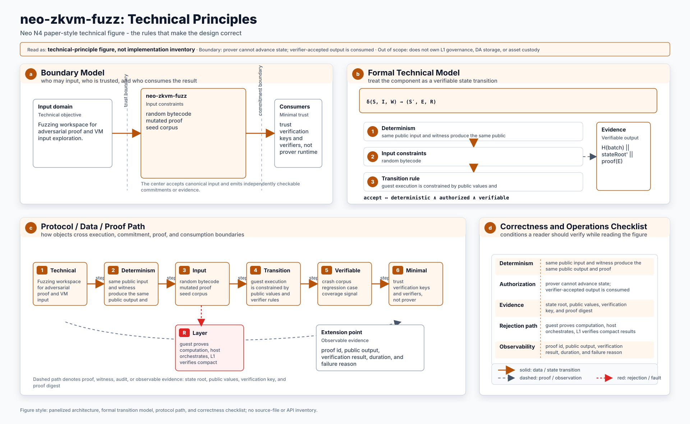
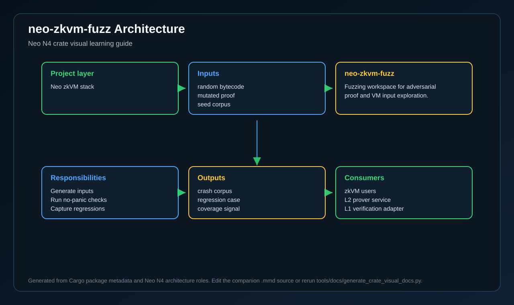
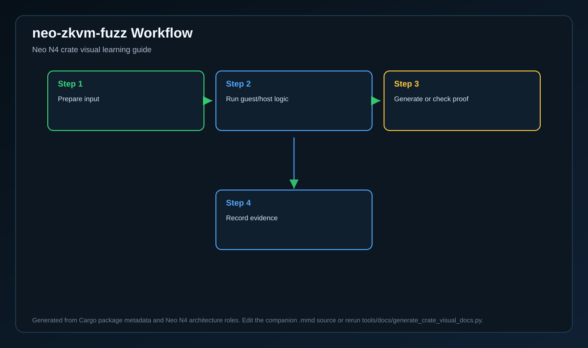
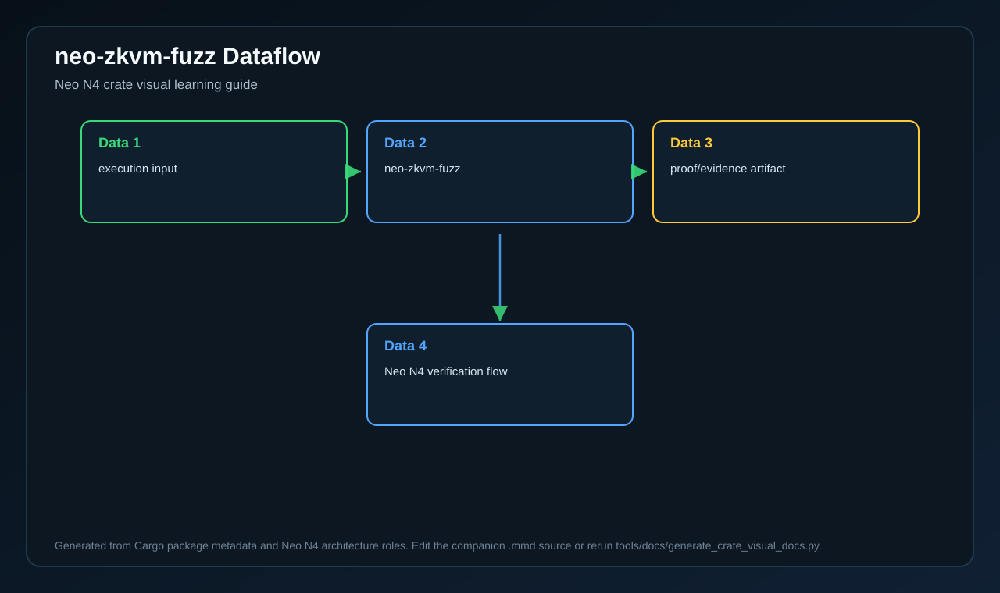
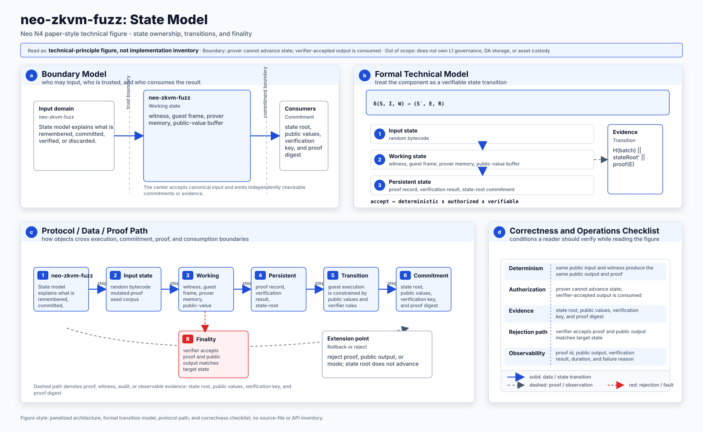
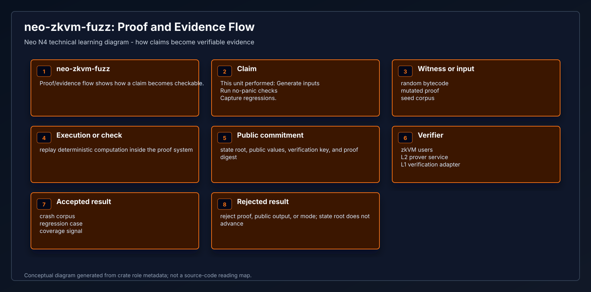
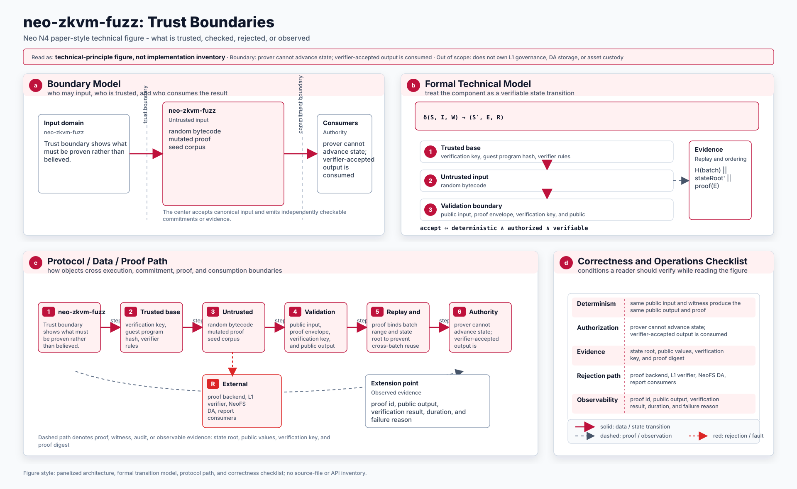
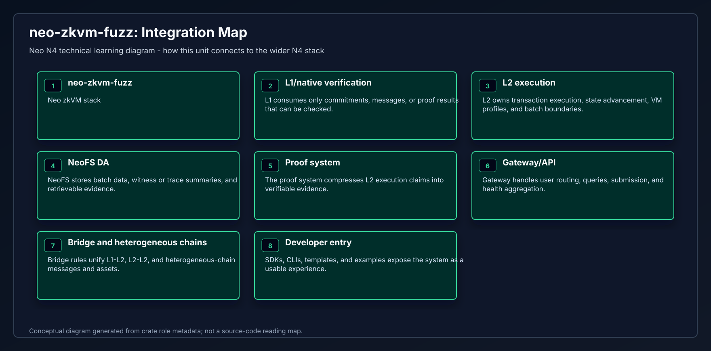
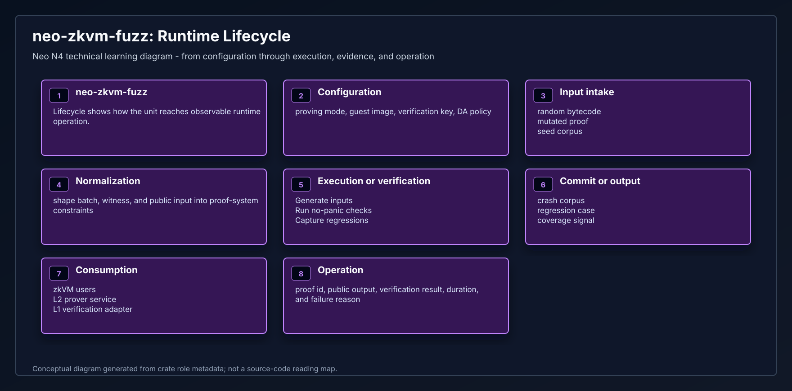

# neo-zkvm-fuzz

<!-- N4-CRATE-VISUAL-GUIDE:START -->
## Technical Visual Guide

These diagrams are local to this crate and explain `neo-zkvm-fuzz` at the technical architecture level. They focus on system role, principles, data movement, workflow, state, proof/evidence, trust boundaries, integration, and runtime lifecycle.

Full technical explanation: [docs/learning-guide.md](docs/learning-guide.md).

| View | Diagram | Mermaid |
| --- | --- | --- |
| System Position |  | [Mermaid](docs/figures/position.mmd) |
| Technical Principles |  | [Mermaid](docs/figures/principles.mmd) |
| Conceptual Architecture |  | [Mermaid](docs/figures/architecture.mmd) |
| Workflow |  | [Mermaid](docs/figures/workflow.mmd) |
| Data Flow |  | [Mermaid](docs/figures/dataflow.mmd) |
| State Model |  | [Mermaid](docs/figures/state-model.mmd) |
| Proof and Evidence Flow |  | [Mermaid](docs/figures/proof-flow.mmd) |
| Trust Boundaries |  | [Mermaid](docs/figures/trust-boundaries.mmd) |
| Integration Map |  | [Mermaid](docs/figures/integration-map.mmd) |
| Runtime Lifecycle |  | [Mermaid](docs/figures/lifecycle.mmd) |

### Technical Role

- **Layer:** Neo zkVM stack
- **Purpose:** Fuzzing workspace for adversarial proof and VM input exploration.
- **Inputs:** random bytecode | mutated proof | seed corpus
- **Responsibilities:** Generate inputs | Run no-panic checks | Capture regressions
- **Outputs:** crash corpus | regression case | coverage signal
- **Consumers:** zkVM users | L2 prover service | L1 verification adapter

## Targets

| Target | What it stresses |
| --- | --- |
| `fuzz_vm_execution` | Structured Neo opcode fragments + stack args |
| `fuzz_script_parser` | Arbitrary gas + integer args over structured scripts |
| `fuzz_raw_script` | Raw/unstructured bytecode under tight gas budgets |
| `fuzz_proof_pipeline` | Mock prove → verify → bincode round-trip → tamper |
| `fuzz_bincode` | Deserialize NeoProof/ProofInput/StackItem (no panic) |
| `fuzz_assembler` | Arbitrary NeoASM source + CHECKSIG/macro paths |
| `fuzz_attestation` | N-of-M ECDSA digests, threshold, JSON/config, tamper |

## Run

```bash
# Full campaign (default 10k runs / target)
./scripts/fuzz-all.sh

# Longer campaign
RUNS=100000 ./scripts/fuzz-all.sh

# Continuous rotating campaign (exits on real crash-*/timeout-*/leak-*)
./scripts/fuzz-continuous.sh
# SLICE=120 MAX_LEN=512 ./scripts/fuzz-continuous.sh

# Single target
cd fuzz
cargo +nightly fuzz run --sanitizer none fuzz_raw_script -- \
  -runs=50000 -max_len=512 -rss_limit_mb=0 -malloc_limit_mb=256 -timeout=10
```

**RSS note:** libFuzzer’s default `-rss_limit_mb=2048` can false-positive on
high-throughput targets (allocator retains process RSS). Campaigns use
`-rss_limit_mb=0` and `-malloc_limit_mb=256` so single huge allocs still fail.

CI runs a short smoke of every target on each PR (`fuzz-smoke` job).

### Reading Order

1. Start with system position and conceptual architecture.
2. Read technical principles, trust boundaries, and state model to understand correctness.
3. Follow workflow and dataflow to see runtime movement.
4. Use proof/evidence flow, integration map, and lifecycle for operational understanding.
<!-- N4-CRATE-VISUAL-GUIDE:END -->
