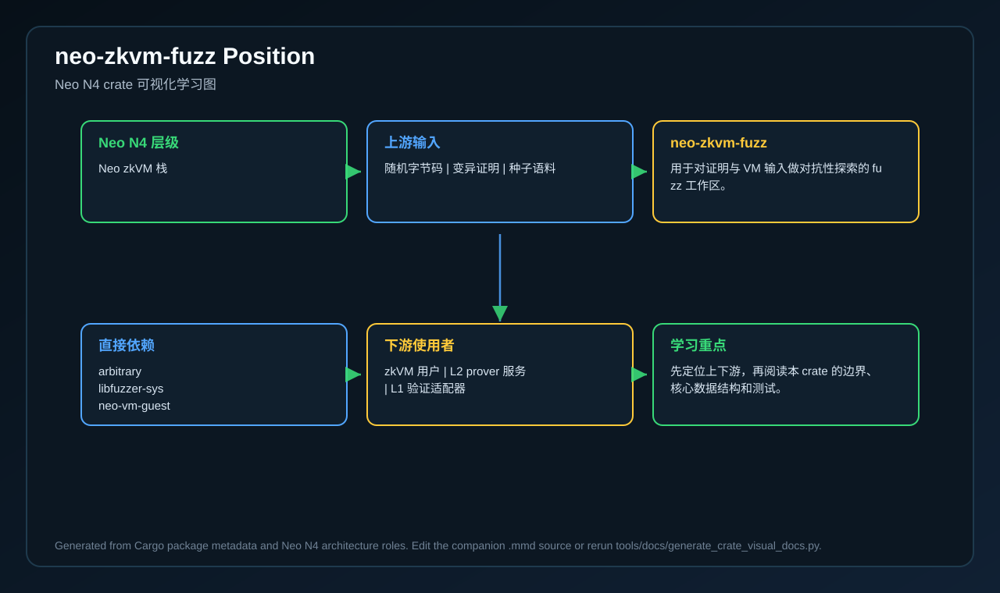
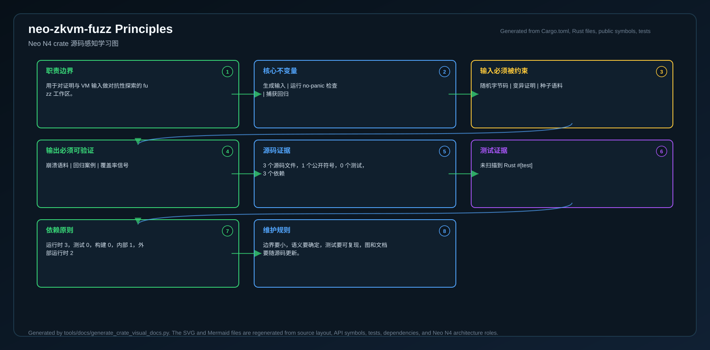
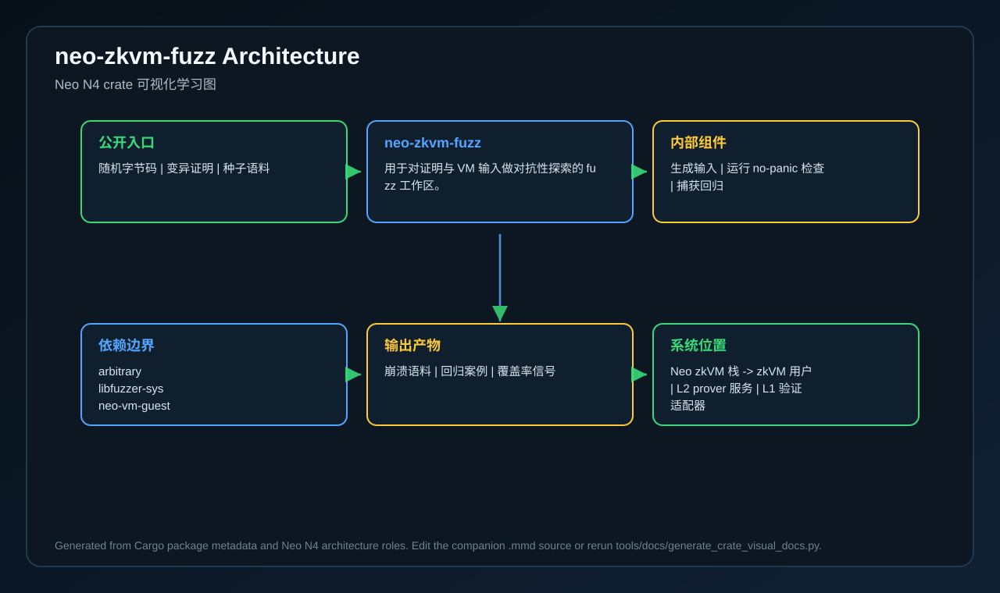
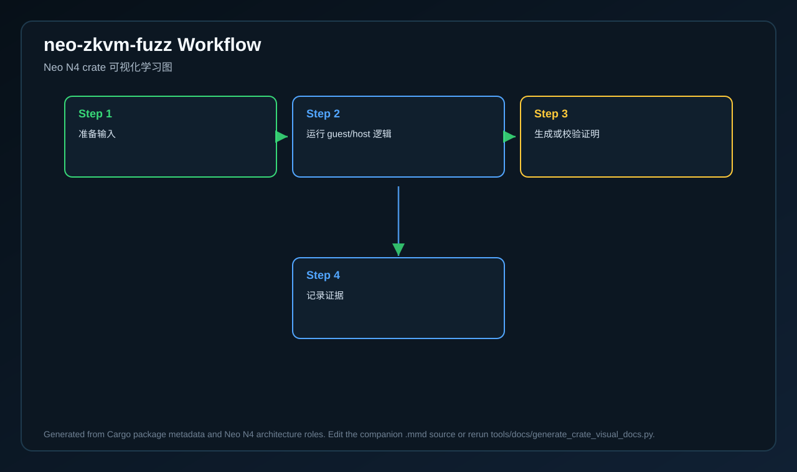
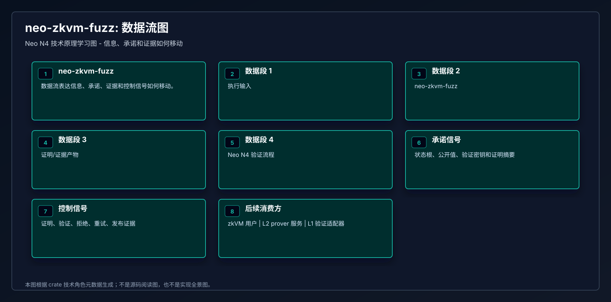
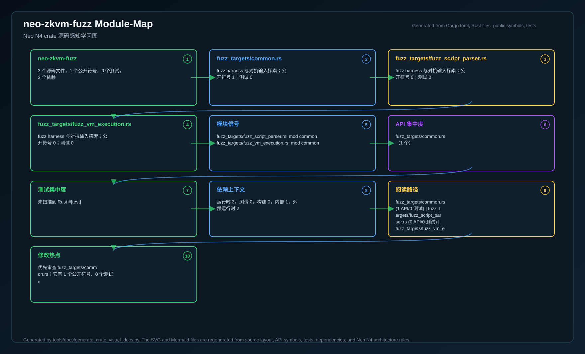
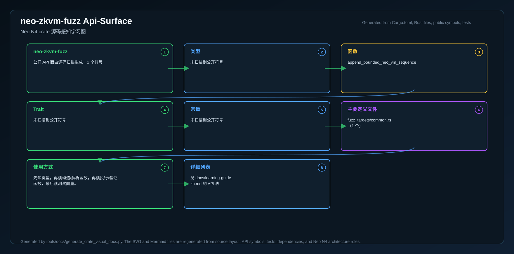
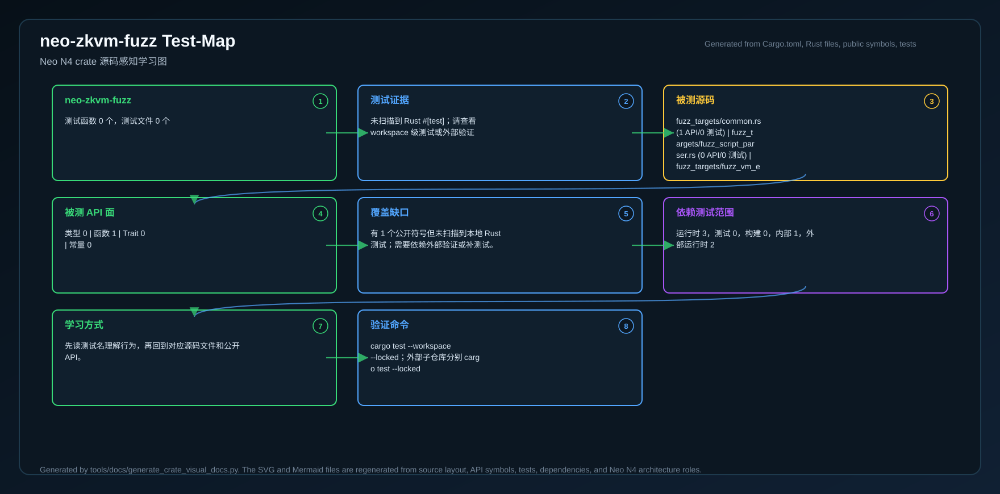
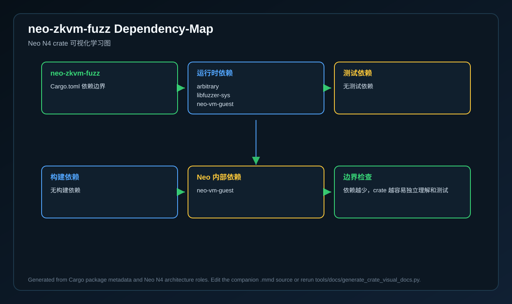
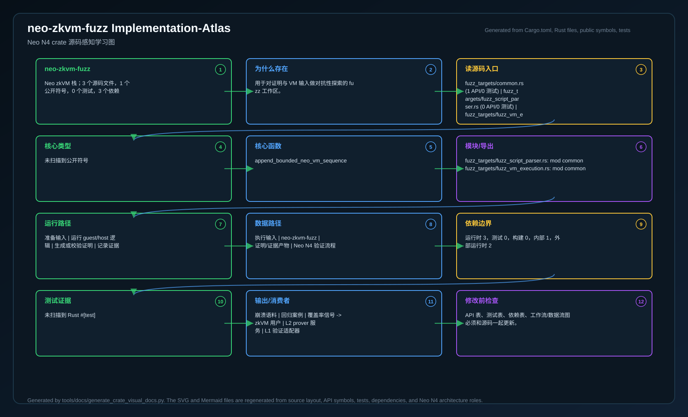

# neo-zkvm-fuzz

<!-- N4-CRATE-VISUAL-GUIDE-ZH:START -->

## 可视化学习指南

这些图是 `neo-zkvm-fuzz` 自己目录下的 crate 专属学习资料，用来说明它在 Neo N4 中的位置、自己负责的技术边界、内部工作流，以及数据如何流经它。

完整的源码级解释见 [docs/learning-guide.zh.md](docs/learning-guide.zh.md)。

| 视图 | 图片 | 源文件 |
| --- | --- | --- |
| 在 Neo N4 中的位置 |  | [Mermaid](docs/figures/position.zh.mmd) |
| 技术原理 |  | [Mermaid](docs/figures/principles.zh.mmd) |
| 架构 |  | [Mermaid](docs/figures/architecture.zh.mmd) |
| 工作流 |  | [Mermaid](docs/figures/workflow.zh.mmd) |
| 数据流 |  | [Mermaid](docs/figures/dataflow.zh.mmd) |
| 模块图 |  | [Mermaid](docs/figures/module-map.zh.mmd) |
| 公开 API 图 |  | [Mermaid](docs/figures/api-surface.zh.mmd) |
| 测试证据图 |  | [Mermaid](docs/figures/test-map.zh.mmd) |
| 依赖图 |  | [Mermaid](docs/figures/dependency-map.zh.mmd) |
| 实现全景图 |  | [Mermaid](docs/figures/implementation-atlas.zh.mmd) |

### 在 Neo N4 中的作用

- **层级:** Neo zkVM 栈
- **目的:** 用于对证明与 VM 输入做对抗性探索的 fuzz 工作区。
- **主要输入:** 随机字节码、变异证明、种子语料
- **主要输出:** 崩溃语料、回归案例、覆盖率信号
- **下游使用者:** zkVM 用户、L2 prover 服务、L1 验证适配器
- **扫描到的源码文件:** 3
- **扫描到的公开符号:** 1
- **扫描到的 Rust 测试:** 0

### 边界与职责

- **本 crate 负责:** 生成输入、运行 no-panic 检查、捕获回归
- **本 crate 消费:** 随机字节码、变异证明、种子语料
- **本 crate 产出:** 崩溃语料、回归案例、覆盖率信号
- **主要被谁使用:** zkVM 用户、L2 prover 服务、L1 验证适配器

### 源码地图快照

| 文件 | 为什么重要 | 公开 API | 测试 |
| --- | --- | ---: | ---: |
| `fuzz_targets/common.rs` | fuzz harness 与对抗输入探索 | 1 | 0 |
| `fuzz_targets/fuzz_script_parser.rs` | fuzz harness 与对抗输入探索 | 0 | 0 |
| `fuzz_targets/fuzz_vm_execution.rs` | fuzz harness 与对抗输入探索 | 0 | 0 |

### API 快照

| 类型 | 代表符号 |
| --- | --- |
| 类型 | 未扫描到公开符号 |
| 函数 | append_bounded_neo_vm_sequence |
| Trait | 未扫描到公开符号 |
| 常量 | 未扫描到公开符号 |

### 学习路径

1. 先看位置图，明确这个 crate 为什么存在、上游是谁、下游是谁。
2. 再看技术原理图，理解它的核心不变量、职责边界和维护规则。
3. 然后看模块图和 API 图，确定先读哪些文件、哪些符号。
4. 最后看工作流、数据流、测试证据图和依赖图，再进入源码会更容易理解。
5. 如果希望一张图看完整体，就看实现全景图；它把源码入口、API、数据流、测试、依赖和修改检查点放在一起。

<!-- N4-CRATE-VISUAL-GUIDE-ZH:END -->
